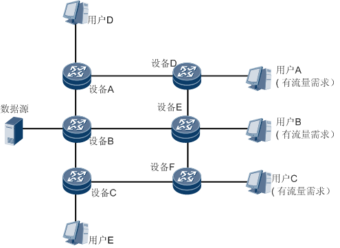
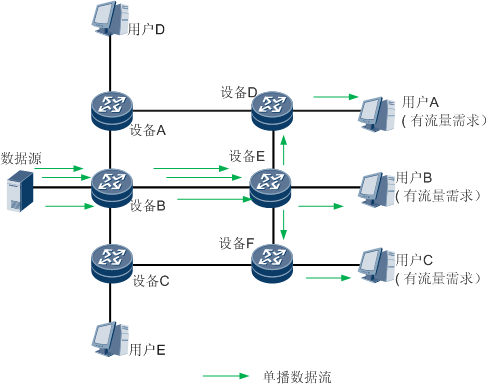
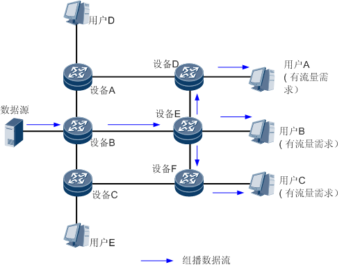
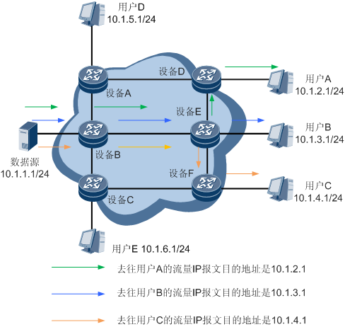
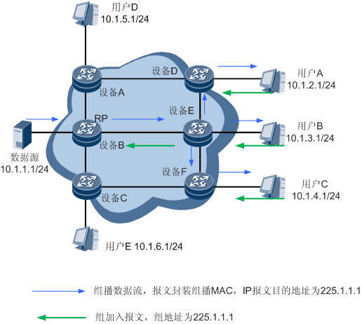

## 三种 IP 报文传输模式

单播、组播和广播都是IP报文网络传输的三种模式，它们的定义如下：

- 单播是主机间一对一的通讯模式，网络中的设备根据网络报文中包含的目的地址选择传输路径，将单播报文传送到指定的目的地，只对接收到的数据进行转发，不会进行复制。它能够针对每台主机及时的响应，现在的网页浏览全部都是采用单播模式。
- 广播是主机间一对所有的通讯模式，设备会将报文发送到网络中的所有可能接收者。设备简单地将它收到的任何广播报文都复制并转发到除该报文到达的接口外的每个接口。广播处理流程简单，不用选择路径。
- 组播是主机间一对多的通讯模式， 组播是一种允许一个或多个组播源发送同一报文到多个接收者的技术。组播源将一份报文发送到特定的组播地址，组播地址不同于单播地址，它并不属于特定某个主机，而是属于一组主机。一个组播地址表示一个群组，需要接收组播报文的接收者都加入这个群组。

用户主机是通过识别 IP 地址，区分 IP 传输的方式。IP 地址被分为三类，分别是：

- 单播 IP 地址：一个单播 IP 地址只能标识一台用户主机。一份使用单播 IP 地址为目的地址的 IP 报文，只能被一台用户主机接收。
- 广播 IP 地址：一个广播 IP 地址能够标识某确定网段内的所有用户主机。一份使用广播 IP 地址为目的地址的 IP 报文，能够被该网段内的所有用户主机接收。IP 广播报文不能跨网段传播。
- 组播 IP 地址：一个组播 IP 地址能够标识网络不同位置的多个用户主机，一台用户主机可以同时识别多个组播 IP 地址。一份使用组播 IP 地址为目的地址的 IP 报文，能够被网络不同位置的多个用户主机接收。

用户主机使用不同的类别的 IP 地址，就选用了不同的传输方式：

- IP 报文网络传输使用单播 IP 地址的，简称为单播。
- IP 报文网络传输使用广播 IP 地址的，简称为广播。
- IP 报文网络传输使用组播 IP 地址的，简称为组播。

## 点到多点场景

网络中有用户 A，用户 B，用户 C，用户 D 和用户 E，但现在只有用户 A，用户 B 和用户 C 有流量需求，想接收数据源发送的报文，现分别采用单播、组播、广播方式进行报文的传输。

用单播传输方式后，要确保有流量需求的用户都能收到流量，数据源需要发送三份流量，相应的网络中设备 B 也需要承载三份流量。

用广播传输方式后，数据源仅发送一份流量，有流量需求的用户可以收到流量，但是从图中可以看出，因为广播的传输机制，无流量需求的用户 D 和用户 E 也收到了流量，存在流量的冗余。

采用组播传输方式后，数据源仅发送一份流量，有流量需求的用户就可以收到流量，而且无流量需求的用户 D 和用户 E 也不会收到冗余的流量。

| 传输方式 | 优势                                                         | 不足                                                         |
| -------- | ------------------------------------------------------------ | ------------------------------------------------------------ |
| 单播方式 | 一份单播报文，使用一个单播地址作为目的地址。Source 向每个 Receiver 地址发送一份独立的单播报文。如果网络中存在 N 个接收者，则组播源需要发送 N 份单播报文。网络为每份单播报文执行独立的数据转发，形成一条独立的数据传送通路。N 份单播报文形成 N 条相互独立的传输路径。 | 单播方式下，网络中传输的信息量和需求该信息的用户量成正比，当需求该信息的用户量较大时，网络中将出现多份相同信息流，不仅占用处理器资源而且浪费带宽。单播方式较适合用户稀少的网络，当用户量较大时很难保证网络传输质量。 |
| 广播方式 | 一份广播报文，使用一个广播地址作为目的地址。Source 向本网段对应的广播地址发送且仅发送一份报文。不管是否有需求，保证报文被网段中的所有用户主机接收。 | 广播方式下，信息发送者与用户主机被限制在一个共享网段中，且该网段所有用户主机都能接收到该信息，这样会导致无信息需求的主机也收到该信息，网络中流量有冗余。广播方式只适合共享网段，且信息安全性和有偿服务得不到保障。 |
| 组播方式 | 一份组播报文，使用一个组播地址作为目的地址。Source（组播源）向一个组播地址发送且仅发送一份报文。网络中部署的组播协议为此组播报文建立一棵树型路由，根是 Source，叶子是所有组播组成员。组播方式下，单一的信息流沿树型路径被同时发送给一组用户，相同的组播数据流在每一条链路上最多仅有一份。相比单播来说，使用组播方式传递信息，用户的增加不会显著增加网络的负载，减轻了服务器和 CPU 的负荷。组播报文可以跨网段传输，不需要此报文的用户不能收到此报文。相比广播来说，使用组播方式可以远距离传输信息，且只将信息传输到有接收者的地方，保障了信息的安全性。组播技术有效地解决了单点发送多点接收的问题，实现了 IP 网络中点到多点的高效数据传送。 | NA                                                           |

## 组播实现机制

单播组网中要实现用户 A，用户 B，用户 C 能接收数据源的流量，需要做如下配置：

- 全网设备相连的接口都需要配置单播 IP 地址。
- 全网要部署单播路由协议，确保数据源和用户 A、用户 B 和用户 C 之间路由互通。

数据源发流的时候，对用户 A 发送的流量 IP 报文头封装的目的地址是用户 A 的主机地址 10.1.2.1；

对用户 B 发送的流量 IP 报文头封装的目的地址是用户 B 的主机地址 10.1.3.1；

对用户 C 发送的流量是 IP 报文头封装的目的地址是用户 C 的主机地址 10.1.4.1。

组播组网实现用户 A，用户 B 和用户 C 能接收到数据源的流量，需要做如下部署：

- 全网设备相连的接口都需要配置单播 IP 地址。
- 全网要部署单播路由协议，确保数据源和用户 A、用户 B 和用户 C 之间路由互通。
- 全网部署组播 PIM 协议（PIM-SM 或者 PIM-DM），并配置相应的 BSR 和 RP，图中配置设备 B 为 RP 和 BSR。
- 用户 A，用户 B，用户 C 必须发送 IGMP 组加入报文，组加入报文中包含其需要加入的组 IP 地址 225.1.1.1。

数据源发送数据流，该数据流二层目的 MAC 地址是组播的 MAC 地址，IP 报文的目的地址为 225.1.1.1。

组播实现机制总体来说就是接收者告诉一个中心节点（在组播协议里面称为 RP），它需要哪些组地址的流量；RP 需要被告之数据源（在组播场景中我们称之为组播源，它的特点是流量二层头中目的 MAC 地址是组播 MAC 地址，IP 报层 IP 报文头目的地址是组播 IP 地址）在哪，数据源往哪些组地址发流。RP 知道了接收方和发送方的所有信息后，就会根据需要把流量发送到特定位置（它发送的过程中建立了组播分发树）。

在组播部署的时候，源注册过程组播源必须知道 RP 的路由，才能发送过去，源注册报文是单播报文。

另外组播分发树建立的过程中，是需要查到组播源（或者 RP）的路由的，在组播中我们称为 RPF 检查，这个也需要单播路由的支持。