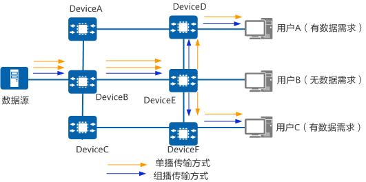
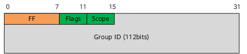
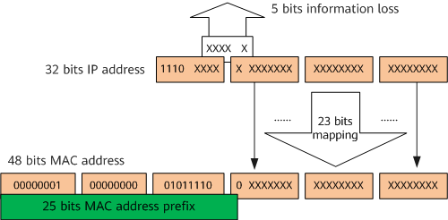
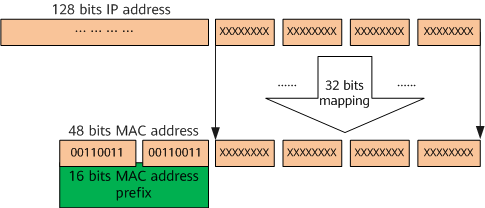

## IP 组播基本概念

- 组播组

用 IP 组播地址进行标识的一个集合。任何用户主机（或其他接收设备）加入一个组播组，就成为了该组成员，可以识别并接收发往该组播组的组播数据。

- 组播组成员

所有加入某组播组的主机便成为该组播组的成员。组播组中的成员是动态的，主机可以在任何时刻加入或离开组播组。组播组成员可以广泛地分布在网络中的任何地方。

- 组播源

信息的发送者称为“组播源”，组播组地址为目的地址。一个组播源可以同时向多个组播组发送数据，多个组播源也可以同时向一个组播组发送报文。组播源通常不需要加入组播组。

- 组播设备

支持三层组播功能的路由器或交换机。组播设备不仅能够提供组播路由功能，也能够在与用户连接的末梢网段上提供组播组成员的管理功能。

## 组播实现机制

组播是主机间一对多的通讯模式， 组播是一种允许一个或多个组播源发送同一报文到多个接收者的技术。组播源将一份报文发送到特定的组播地址，组播地址不同于单播地址，它并不属于特定某个主机，而是属于一组主机。一个组播地址表示一个群组，需要接收组播报文的接收者都加入这个群组。



## IP 组播服务模型

组播服务模型的分类是针对接收者主机的。组播源发出的组播数据中总是以组播源自己的 IP 地址为报文的源地址，组播组地址为目的地址。而接收者主机接收数据时可以对源进行选择，因此产生了任意源组播 ASM（Any-Source Multicast）和指定源组播 SSM（Source-Specific Multicast）两种服务模型。

这两种服务模型使用不同的组播组地址范围。ASM 模型的组播组地址范围为 224.0.1.0～231.255.255.255 或 233.0.0.0～238.255.255.255。SSM 模型的组播组地址范围为 232.0.0.0～232.255.255.255。

### ASM模型

ASM 模型仅针对组地址提供组播分发。一个组播组地址作为一个网络服务的集合，任何源发布到该组地址的数据得到同样的服务。接收者主机加入组播组以后可以接收到任意源发送到该组的数据。

ASM 模型要求组地址必须整个组播网络中唯一。“唯一” 指的是同一时刻一个 ASM 地址只能被一种组播应用使用。如果有两种不同的应用程序使用了同一个 ASM 组地址发送数据，它们的接收者会同时收到来自两个源的数据。这样一方面可能会导致网络流量拥塞，另一方面也会给接收者主机造成困扰。在 ASM 模型中，接收者无法预先知道组播源的位置，接收者可以在任意时间加入或离开该组播组。

ASM 模型下还有一种特殊的组播模型 —— 过滤源组播 SFM（Source-Filtered Multicast）。SFM 在 ASM 模型的基础上添加了组播源过滤策略，提高了安全性。在 SFM 模型下，设备配置针对组播源的过滤策略，允许或禁止来自某些组播源的报文通过。从发送者角度来看，组播组成员关系完全相同；从接收者角度看，数据是经过筛选的。

接收者主机加入组播组后可以接收任意源发送到该组的数据

- IGMPv1/v2、MLDv1/v2

ASM地址=任意源+组播组地址 (*,G)

要求组地址必须整个组播网络中"唯一"

- 唯一是指在同一时刻一个 ASM 地址只能被一种组播应用使用
  - 如果在同一时刻有两个或者多个不同应用使用同一个 ASM 地址发送数据。会导致它们的接收者会受到来自两个源的数据，数据会混乱，也会导致网络拥塞

### SSM 模型

SSM 模型针对特定源和组的绑定数据流提供服务，接收者主机在加入组播组时，可以指定只接收哪些源的数据。加入组播组以后，主机只会收到指定源发送到该组的数据。

SSM 模型对组地址不再要求全网唯一，只需要每个组播源保持唯一。这里的 “唯一” 指的是同一个源上不同的组播应用必须使用不同的 SSM 地址来区分。不同的源之间可以使用相同的组地址，因为 SSM 模型中针对每一个（源，组）信息都会生成表项。这样一方面节省了组播组地址，另一方面也不会造成网络拥塞。

接收者主机加入组播组后可以接受特定源发送到该组的数据

- IGMPv3

SSM地址=组播源IP+组播组地址 (S,G)

不要求组地址全网唯一，需要每个组播源保持”唯一“

- 唯一是指同一个源上不同的组播应用必须使用不同的 SSM 地址来区分
- 不同的组播源之间可以使用相同的组地址，因为 SSM 模型针对每个(S,G)信息都会生产表项。节省组播组地址、不会造成网络拥塞

## IP 组播地址的范围

为了使组播源和组播组成员进行通信，需要提供网络层组播使用的 IP 组播地址。

### IPv4 组播地址

IANA 将 D 类地址空间分配给 IPv4 组播使用。IPv4 地址一共 32 位，D 类地址最高 4 位为 1110，地址范围从 224.0.0.0 到 239.255.255.255，具体分类及含义：

| 地址范围                                                   | 含义                                                         |
| ---------------------------------------------------------- | ------------------------------------------------------------ |
| 224.0.0.0～224.0.0.255                                     | 永久组地址范围。IANA 为路由协议预留的IP地址范围（也称为保留组地址范围），用于标识一组特定的网络设备，供路由协议、拓扑查找等使用，不用于组播转发。 |
| 224.0.1.0～231.255.255.255<br />233.0.0.0～238.255.255.255 | ASM组播地址范围，全网范围内有效。说明：其中，224.0.1.39 和224.0.1.40是保留地址，不建议使用。 |
| 232.0.0.0～232.255.255.255                                 | 缺省情况下的 SSM 组播地址范围，全网范围内有效。              |
| 239.0.0.0～239.255.255.255                                 | 本地管理组地址范围，仅在本地管理域内有效。在不同的管理域内重复使用相同的本地管理组地址不会导致冲突。 |

常见的永久组地址列表

| 永久组地址                                              | 含义                                                         |
| ------------------------------------------------------- | ------------------------------------------------------------ |
| 224.0.0.0                                               | 不分配                                                       |
| 224.0.0.1                                               | 网段内所有主机和组播设备的地址（等效于广播地址）             |
| 224.0.0.2                                               | 所有组播设备的地址                                           |
| 224.0.0.3                                               | 不分配                                                       |
| 224.0.0.4                                               | DVMRP（Distance Vector Multicast Routing Protocol，距离矢量组播路由协议）路由器的地址 |
| 224.0.0.5                                               | OSPF（Open Shortest Path First，开放最短路径优先）路由器的地址 |
| 224.0.0.6                                               | OSPF DR（Designated Router，指定路由器）的地址               |
| 224.0.0.7                                               | ST（Shared Tree，共享树）路由器的地址                        |
| 224.0.0.8                                               | ST 主机的地址                                                |
| 224.0.0.9                                               | RIP-2（Routing Information Protocol version 2，路由信息协议版本 2）路由器的地址 |
| 224.0.0.11                                              | 移动代理（Mobile-Agents）的地址                              |
| 224.0.0.12                                              | DHCP（Dynamic Host Configuration Protocol，动态主机配置协议）服务器/中继代理的地址 |
| 224.0.0.13                                              | 所有 PIM（Protocol Independent Multicast，协议无关组播）路由器的地址 |
| 224.0.0.14                                              | 用于 RSVP（Resource Reservation Protocol，资源预留协议）封装 |
| 224.0.0.15                                              | 所有 CBT（Core-Based Tree，有核树）路由器的地址              |
| 224.0.0.16                                              | 指定 SBM（Subnetwork Bandwidth Management，子网带宽管理）的地址 |
| 224.0.0.17                                              | 所有 SBM 的地址                                              |
| 224.0.0.18                                              | VRRP（Virtual Router Redundancy Protocol，虚拟路由器冗余协议）地址 |
| 224.0.0.22                                              | 所有使能 IGMPv3（Internet Group Management Protocol, Version 3，因特网组管理协议）的路由器地址 |
| 224.0.0.19 ～ 224.0.0.21<br />224.0.0.23 ～ 224.0.0.255 | 未指定                                                       |

### IPv6 组播地址

IPv6 地址长度是 128 位，IPv6 组播地址格式如图所示。



IPv6 组播地址格式

- IPv6 组播地址总是以 FF 开头，高 8 位取值为 11111111。
- Flags 字段（4 位）用来标识组播地址的状态。例如取值为 0 表示保留组地址，取值为 1 或 2 表示 ASM 范围内的组播地址，取值为 3 表示 SSM 范围内的组播地址。
- Scope 字段（4 位）用来标识组播组的应用范围，指示组播组应用范围是只包含同一本地网络、同一站点、同一机构中的节点，还是包含全球地址空间内的任何节点。
- Group ID（112 位）组播组标识符，用在由 Scope 字段所指定的范围内标识组播组。

固定的 IPv6 组播地址的范围及含义如图所示。

| 范围                                                 | 含义                                  |
| ---------------------------------------------------- | ------------------------------------- |
| FF0x::/32                                            | 保留组地址。                          |
| FF1x::/32（x不能是1或者2）FF2x::/32（x不能是1或者2） | ASM组播地址范围，全网范围内有效。     |
| FF3x::/32（x不能是1或者2）                           | 缺省的SSM组地址范围，全网范围内有效。 |

## 组播 MAC 地址的范围

为了在本地物理网络上实现组播信息的正确传输，需要在链路层使用组播 MAC 地址。组播数据传输时，其目的地不是一个具体的接收者，而是一个成员不确定的组，所以需要一种技术将 IP 组播地址映射为组播 MAC 地址。

### IPv4 组播 MAC 地址

以太网传输 IPv4 单播报文的时候，目的 MAC 地址使用的是接收者的 MAC 地址。但是在传输组播数据时，其目的地不再是一个具体的接收者，而是一个成员不确定的组，所以要使用 IPv4 组播 MAC 地址，即 IPv4 组播地址映射到链路层中的地址。

IANA 规定，IPv4 组播 MAC 地址的高 24 位为 0x01005e，第 25 位为 0，低 23 位为 IPv4 组播地址的低 23 位，映射关系如图所示。例如组播组地址 224.0.1.1 对应的组播 MAC 地址为 01-00-5e-00-01-01。



IPv4 组播地址的前 4 位是固定的 1110，对应组播 MAC 地址的高 25 位，后 28 位中只有 23 位被映射到 MAC 地址，因此丢失了 5 位的地址信息，直接结果是有 32 个 IPv4 组播地址映射到同一 MAC 地址上。例如 IP 地址为 224.0.1.1、224.128.1.1、225.0.1.1、239.128.1.1 等组播组的组播 MAC 地址都为 01-00-5e-00-01-01。

### IPv6 组播 MAC 地址

IPv6 组播 MAC 地址的高 16 位为 0x3333，低 32 位为 IPv6 组播地址的低 32 位。如图所示，是 IPv6 组播地址的 MAC 地址映射关系。



## 组播协议

在 IP 组播传输模型中，发送者不关心接收者所处的位置，只要将数据发送到约定的目的地址，剩下的工作就交给网络去完成。网络中的组播设备必须收集接收者的信息，并按照正确的路径实现组播报文的转发和复制。在组播的发展过程中，形成了一套完整的协议来完成此任务。

### IPv4 网络中使用的组播协议

- 组播组管理协议 IGMP（Internet Group Management Protocol）

IGMP 是负责 IPv4 组播成员管理的协议，运行在组播网络中的最后一段，即三层网络设备与用户主机相连的网段内。IGMP 协议在主机端实现组播组成员加入与离开，在上游的三层设备中实现组成员关系的维护与管理，同时支持与上层组播路由协议的信息交互。

- 协议无关组播 PIM（Protocol Independent Multicast）

PIM 作为一种 IPv4 网络中的组播路由协议，主要用于将网络中的组播数据流发送到有组播数据请求的组成员所连接的组播设备上，从而实现组播数据的路由查找与转发。

PIM 协议包括 PIM-SM（Protocol Independent Multicast Sparse Mode）协议无关组播 - 稀疏模式和 PIM-DM（Protocol Independent Multicast Dense Mode）协议无关组播－密集模式。PIM-SM 适合规模较大、组成员相对比较分散的网络；PIM-DM 适合规模较小、组播组成员相对比较集中的网络。

- 组播源发现协议 MSDP（Multicast Source Discovery Protocol）

MSDP 是为了解决多个 PIM-SM 域之间的互连的一种域间组播协议，用来发现其他 PIM-SM 域内的组播源信息，将远端域内的活动信源信息传递给本地域内的接收者，从而实现组播报文的跨域转发。

- 组播边界网关协议 MBGP（MultiProtocol Border Gateway Protocol）

MBGP 实现了跨 AS 域的组播转发。适用于组播源与组播接收者在不同 AS 域的场景。

- IGMP Snooping

IGMP Snooping 功能可以使设备工作在二层时，通过侦听上游的三层设备和用户主机之间发送的 IGMP 报文来建立组播数据报文的二层转发表，管理和控制组播数据报文的转发，进而有效抑制组播数据在二层网络中扩散。

- BIER

BIER 是基于比特索引的显式复制技术，通过将组播报文目的节点的集合以比特串的方式封装在报文头部进行发送，从而使网络中间节点无需为每一个组播流 (Per-flow) 建立组播树及保存组播流状态，仅需根据报文头部的目的节点的集合进行复制转发。

### IPv6 网络中使用的组播协议

- 组播侦听者发现协议 MLD（Multicast Listener Discovery）

MLD 是负责 IPv6 组播成员管理的协议，运行在组播网络中的最后一段，即三层组播设备与用户主机相连的网段内。MLD 协议在主机端实现组播组成员加入与离开，在三层设备上实现组成员关系的维护与管理，同时支持与组播路由协议的信息交互。

- PIM（IPv6）

PIM（IPv6）作为一种 IPv6 网络中的组播路由协议，主要用于将网络中的组播数据流引入到有组播数据请求的组成员所连接的路由器上，从而实现组播数据流的路由查找与转发。

PIM（IPv6）协议包括 PIM-SM（IPv6）和 PIM-DM（IPv6）两种模式。PIM-SM（IPv6）适合规模较大、组成员相对比较分散的网络；PIM-DM（IPv6）适合规模较小、组播组成员相对比较集中的网络。

- MLD Snooping

MLD Snooping 功能可以使设备工作在二层时，通过侦听上游的三层设备和用户主机之间发送的 MLD 报文来建立组播数据报文的 IPv6 二层转发表，管理和控制组播数据报文的转发，进而有效抑制组播数据在二层网络中扩散

- BIERv6

BIERv6 技术保留了 BIER 技术的优势，利用 IPv6 可扩展的能力，实现了组播路由技术在 IPv6 网络场景下的新应用。具有易部署、智能化、高可靠性三大特点。

## 其他

查看本机当前加入的组播组：

```bash
netstat -gan
```

确保网络接口支持组播

```bash
ip link show dev eth0
```

如果输出中未包含 `MULTICAST` 标志，说明组播功能未启用。可以使用以下命令启用组播：

```bash
ip link set dev eth0 multicast on
```

可以使用 `ip addr` 命令将主机加入指定的组播组：

```bash
ip addr add 232.8.0.19/32 dev eth0 autojoin
```

加入组播组后，可以使用以下命令验证当前的组播组状态：

```bash
ip maddr show dev eth0
```

该命令会列出接口 `eth0` 当前监听的组播地址。此外，还可以查看 IGMP 状态：

```bash
cat /proc/net/igmp
```

## iperf3 测试组播

可以通过这几个命令加入到不同的组播组。

```bash
ip addr add 225.2.2.5/24 dev enp4s0 autojoin
ip addr change 226.2.2.6/24 dev enp4s0 autojoin
ip addr replace 227.2.2.7/24 dev enp4s0 autojoin
```

组播接收者一端开启 3 个 iperf 服务器进程

```bash
iperf -s -u -B 225.2.2.5 -i 1
iperf -s -u -B 226.2.2.6 -i 1
iperf -s -u -B 227.2.2.7 -i 1
```

另外一台组播源分别向3个组播组推流，查看结果

```bash
iperf -c 225.2.2.5 -u -i 1 -t 5 -B <组播发送网卡IP>
iperf -c 226.2.2.6 -u -i 1 -t 5 -B <组播发送网卡IP>
iperf -c 227.2.2.7 -u -i 1 -t 5 -B <组播发送网卡IP>
```

## 参考资料

- <https://my.oschina.net/emacs_8837192/blog/17384982?utm_source=chatgpt.com>
- <https://zhuanlan.zhihu.com/p/647410453>
