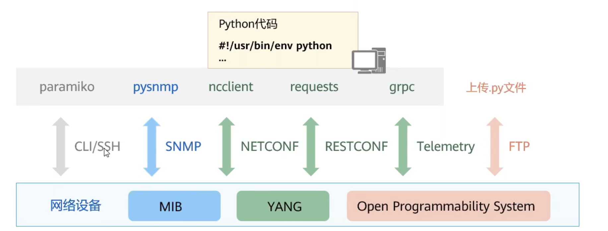

## SDN 简介

软件定义网络（SDN）是一种将网络资源抽象到虚拟化系统中的 IT 基础架构方法。这被称为网络虚拟化。SDN 将网络转发功能与网络控制功能分离开来，目的是创建可集中管理且可编程的网络，这也就是说将控制平面与数据平面分离。SDN 允许 IT 运维团队通过集中面板来控制复杂网络拓扑中的网络流量，而无需手动处理每个网络设备

网络架构的变革，引入了网络控制器，通过全局视角集中控制，实现或业务快速部署、或流量调优、或网络业务开放等目标

### 初级的网络自动化

使用网络自动化的开源工具

Ansible 等工具通过 SSH 连接到设备实现批量化的操作和管理

初级网络自动化基于 CLI 方式管理网络，网络设备返回的是非机构化数据（文本回显），不利于统一处理

网络自动化发展的基础需求是设备提供结构化的数据，设备开放 NETCONF/RESTCONF 接口，提供 XML 或者 JSON 格式的数据类型

### 网络开发与可编程

在开放网络的前提下，使用编程的手段实现自动化的网络

## DataCom

DataCom（Data Communication）

网络开发可编程

## 参考资料

- <https://tonydeng.github.io/sdn-handbook/sdn/>
- <https://www.redhat.com/zh/topics/hyperconverged-infrastructure/what-is-software-defined-networking>
- <https://www.cloudflare.com/zh-cn/learning/network-layer/what-is-sdn/>
