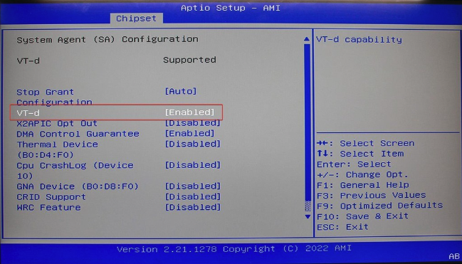
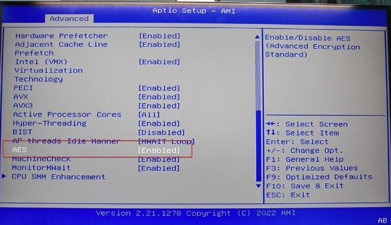

开机按 del/esc 进入 BIOS 设置

## VT-x

VT-x 是 intel 运用 Virtualization 虚拟化技术中的一个指令集；提供 X86 平台的硬件辅助虚拟化解决方案，能够将单台电脑软件环境分割为多个独立分区，每个分区均可以按照需要模拟电脑的一项技术

将多种系统整合到一台服务器或电脑中，使同一个物理平台能够同时运行多个同类或不同类的操作系统，以分别作为不同业务和应用的支撑平台

## VT-d

英特尔定向 I/O 虚拟化技术 (VT-d) 是英特尔虚拟化技术 (VT) 的扩展，它向硬件提供虚拟化解决方案协助

英特尔 VT-d 能帮助用户提高系统的安全性和可靠性，并改善 I/O 设备在虚拟化环境中的性能

这些都从本质上帮助 IT 管理人员通过减少潜在的停机时间而降低总拥有成本；并通过更充分地利用数据中心资源而增大生产性吞吐量

## AES

AES 指令集：高级加密标准指令集（英特尔高级加密标准新指令，简称 AES-NI）是一个 x86 指令集架构的扩展，用于 Intel 和 AMD 微处理器，由 Intel 在 2008 年 3 月提出

该指令集的目的是改进应用程序使用高级加密标准（AES）执行加密和解密的速度，可以提高出国留学的速度。

## 开启睿频加速技术

在 CPU 技术设置选项中，找到 “Intel Turbo Mode Tech” 选项，有的主板可能会显示 “Intel Turbo Boost Tech”

##  C-STATE

C-STATE 是 CPU 的电源管理功能，它会根据 CPU 的负载来管理 CPU 的能耗，和睿频加速技术结合，在运行单线程应用时，C-STATE 会关闭或降低其他核心的能耗，把这些能源加到执行程序的核心上提高 CPU 的执行效率

C-STATE 的模式从 C0 开始，C0 表示 “正常” 的 CPU 运行模式（CPU 已 100% 激活）。C 后的数字越大，表示 CPU 进入休眠模式的程度越深。换言之，关闭的电路和时钟信号越多，完全唤醒 CPU 进入 C0 模式需要的时间越长

| Mode（模式） | 名称               | 作用                                                         | CPU                                                          |
| ------------ | ------------------ | ------------------------------------------------------------ | ------------------------------------------------------------ |
| C0           | 操作状态           | CPU 完全打开                                                 | 所有 CPU                                                     |
| C1           | 停止               | 通过软件停止 CPU 内部主时钟；总线接口单元和 APIC 仍然保持全速运行 | 486DX4 及以上                                                |
| C1E          | 增强型停止         | 通过软件停止 CPU 内部主时钟并降低 CPU 电压；总线接口单元和 APIC 仍然保持全速运行 | 所有 socket 775 CPU                                          |
| C1E          | —                  | 停止所有 CPU 内部时钟                                        | Turion 64、65-nm Athlon X2 和 Phenom CPU                     |
| C2           | 停止授予           | 通过硬件停止 CPU 内部主时钟；总线接口单元和 APIC 仍然保持全速运行 | 486DX4 及以上                                                |
| C2           | 停止时钟           | 通过硬件停止 CPU 内部和外部时钟                              | 仅限 486DX4、Pentium、Pentium MMX、K5、K6、K6-2、K6-III      |
| C2E          | 扩展的停止授予     | 通过硬件停止 CPU 内部主时钟并降低 CPU 电压；总线接口单元和 APIC 仍然保持全速运行 | Core 2 Duo 和更高版本（仅限 Intel）                          |
| C3           | 睡眠               | 停止所有 CPU 内部时钟                                        | Pentium II、Athlon 以上支持，但 Core 2 Duo E4000 和 E6000 上不支持 |
| C3           | 深度睡眠           | 停止所有 CPU 内部和外部时钟                                  | Pentium II 以上支持，但 Core 2 Duo E4000、E6000 和 Turion 64 上不支持 |
| C3           | AltVID             | 停止所有 CPU 内部时钟和降低 CPU 电压                         | AMD Turion 64                                                |
| C4           | 更深入的睡眠       | 降低 CPU 电压                                                | Pentium M 以上支持，但 Core 2 Duo E4000、E6000 和 Turion 64 上不支持 |
| C4E/C5       | 增强的更深入的睡眠 | 大幅降低 CPU 电压并关闭内存高速缓存                          | Core Solo、Core Duo 和 45-nm 移动版 Core 2 Duo 支持          |
| C6           | 深度电源关闭       | 将 CPU 内部电压降低至任何值，包括 0 V                        | 仅 45-nm 移动版 Core 2 Duo 支                                |