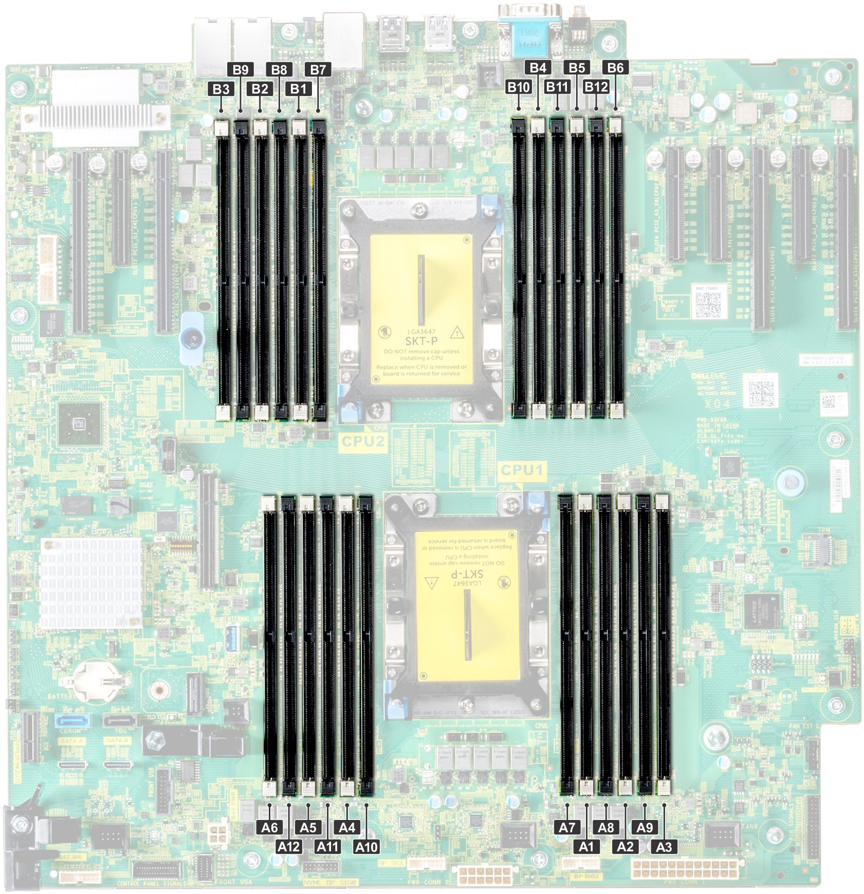

以 Dell T640 为例 <https://www.dell.com/support/manuals/zh-cn/poweredge-t640/pet640_ism_pub/%E7%B3%BB%E7%BB%9F%E5%86%85%E5%AD%98%E6%8C%87%E5%8D%97?guid=guid-a79fd0d7-1791-4771-96ed-03156cf48249&lang=zh-cn>

| 处理器   | 通道 0        | 通道 1        | 通道 2        | 通道 3         | 通道 4         | 通道 5         |
| -------- | ------------- | ------------- | ------------- | -------------- | -------------- | -------------- |
| 处理器 1 | 插槽 A1 和 A7 | 插槽 A2 和 A8 | 插槽 A3 和 A9 | 插槽 A4 和 A10 | 插槽 A5 和 A11 | 插槽 A6 和 A12 |
| 处理器 2 | 插槽 B1 和 B7 | 插槽 B2 和 B8 | 插槽 B3 和 B9 | 插槽 B4 和 B10 | 插槽 B5 和 B11 | 插槽 B6 和 B12 |
