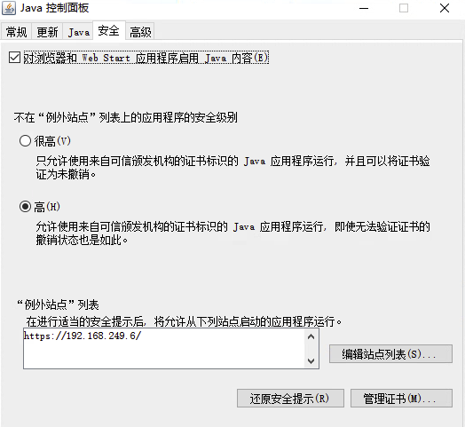

使用 Supermicro X9SRi-F，串行控制台处于开启状态。使用华硕 Z10PA-U8，它已开启。而有了 Intel S1200V3RPL，它就在 .注意： 华硕 Z10PA-U8 需要将波特率设置为 57600，所有其他型号需要将波特率设置为 115200。

## Java 程序无法访问

（1）从 Java 8 Update 131 发行版开始，使用 MD5withRSA 或 MD5withDSA 算法签名的应用程序被视为未签名。

未签名的应用程序请求不受限制地访问系统。 以下资源使用弱签名算法MD5withRSA 进行签名，并被视为未签名。

`C:\Program Files\JAVA\jre...\lib\security\java.security` 注释掉以“jdk.jar”开头的行，如下例所示 -

```
# jdk.jar.disabledAlgorithms=MD2, MD5, RSA keySize < 1024, \
#     DSA keySize < 1024, include jdk.disabled.namedCurves
```

（2）您的安全设置已阻止使用已过期或尚未生效的证书进行签名的应用程序运行出于安全原因，应用程序现在必须满足“高”或“非常高”安全设置的要求或属于“例外站点”列表的一部分

打开 Java 控制面板找到安全 ， 添加例外站点

`C:\Program Files\JAVA\jre...\bin\javacpl.exe`



## 参考资料

- <https://beehosting.pro/kb/ipmi/>