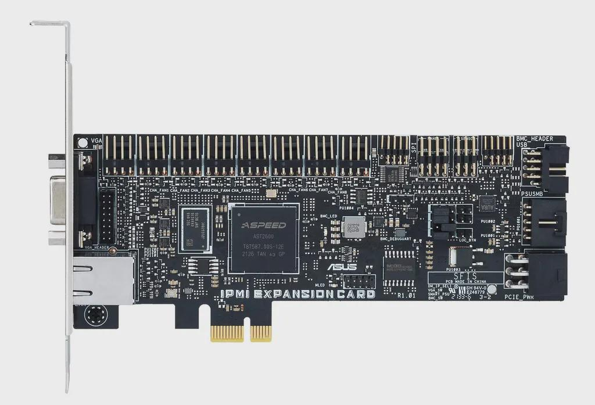
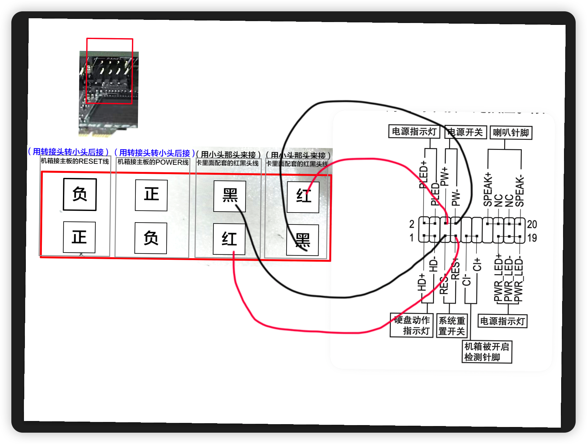
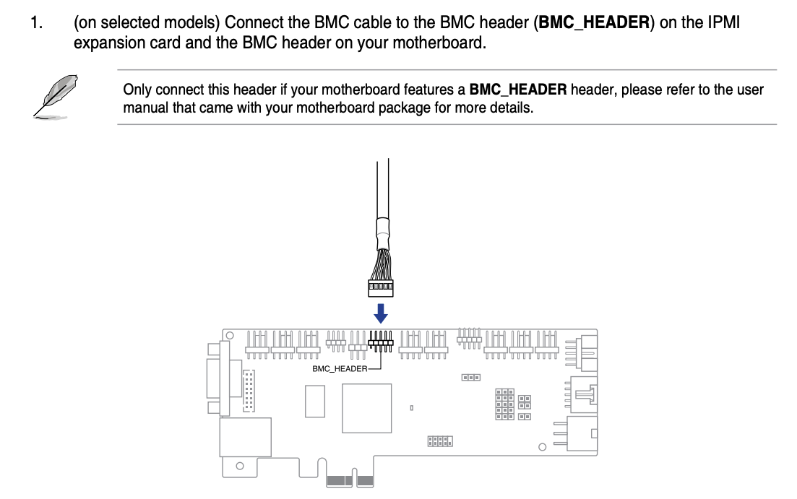
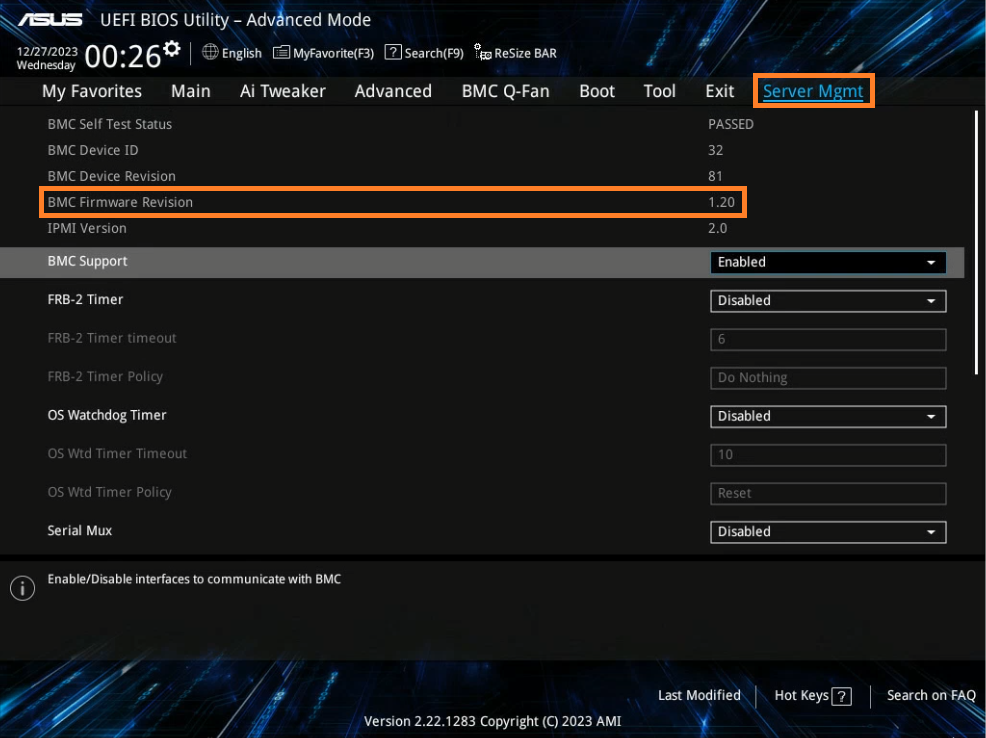
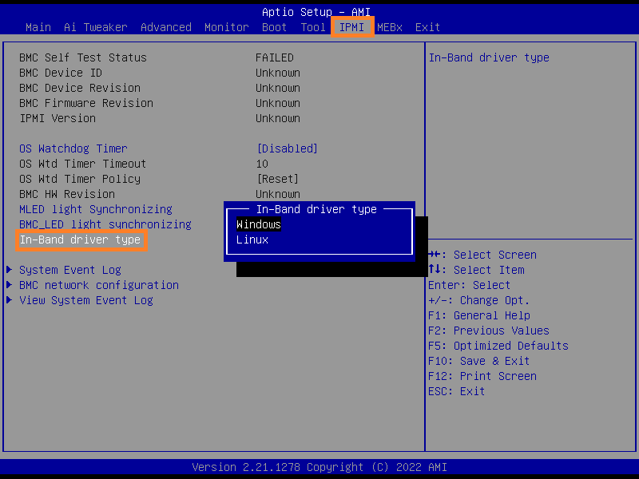

## IPMI EXPANSION CARD



ASPEED AST2600A3-GP 多功能远程管理芯片

I/O 方面，它提供了一个 1GbE 的远程管理网络接口，以及一个用于一些基础显示的 VGA 接口

该 IPMI 扩展卡通过一个 PCI-Express 3.0 x1 主机接口连接到机器上，同时还有一个 BMC、PM-bus 和 SPI 头，并依靠一个 6 针 PCIe 电源连接器满足其电源需求

## 华硕 E21524

必须接的接口：

- （1）USB 接口供电
- （2）如果有显卡需要去掉
- （3）主板→ 带外卡的电源、Reset；带外卡→ 机箱的电源、Reset

### BIOS

BIOS 建议额外设置断电后 USB 仍然供电，通常是华硕主板：

- 英文：

- - 选择 [Advanced] 设定页面的 [APM Configuration] 选项
  - 将 [Erp Ready] 设置为 [Enable (S4+S5)] 或者 [Enable (S5)] (Erp为Energy-related Products欧洲能耗有关联的产品节能要求)；部分主板单独的 USB Standby Power
- 中文
  - 选择高级模式，进入电源管理设置
  - 仍为调整 Erp Ready 或者 USB Standby Power

### 接线图示





为了全面支持 IPMI 扩展卡的功能，安装 IPMI 扩展卡时请注意以下电缆连接：使用 BMC 电缆将 IPMI 扩展卡连接到主板上的 BMC 接头。此连接对于实时监控主板传感器必不可少。

使用 SPI 电缆将 IPMI 扩展卡连接到主板上的 TPM 接头（或 SPI 接头）。此连接对于启用 BIOS 强制更新功能至关重要。

## kcs 接口

### BMC 固件及接线

必须接入 BMC Header



刷入 BMC Fireware，详见官方帮助文档：<https://www.asus.com.cn/support/faq/1047906/>

请至BIOS Advanced Mode-Server Mgmt页面，如下图举例，BMC Firmware 版本为1.20



如需要使用 ipmptool 并透过 kcs 接口重新设置 IPMI Expansion Card 的密码，请到以下 BIOS 选项设置系统对应的 OS 

IPMI \In-Band Driver type ----[Windows] or [Linux]



### 操作系统设置

安装 OpenIPMI

```bash
dnf install OpenIPMI

# 加载内核模块
systemctl enalbe --now ipmi
```

手动加载内核模块可以使用如下命令：

```bash
# 手动构建字符设备，不推荐
# cat /proc/devices | grep ipmi
# mknod /dev/ipmi0 c 238 0x0

modprobe ipmi_devintf
modprobe ipmi_msghandler
modprobe ipmi_poweroff
modprobe ipmi_si
modprobe ipmi_ssif
modprobe ipmi_watchdog

# 如果 ipmi 设备识别不到可以尝试切换 kcs 接口
# rmmod ipmi_si && modprobe -v ipmi_si type="kcs" ports="0xca2" regspacings="4"
```

重置密码，Windows 需要以管理员权限执行

```bash
ipmitool -I ms raw 0x32 0x66
```

### 使用 IPMITool

修改 IP

```bash
# 打印当前 ipmi 地址配置信息
ipmitool lan print 1

# 设置 id 1 为静态 IP 地址
ipmitool lan set 1 ipsrc static

# 设置 IPMI 地址
ipmitool lan set 1 ipaddr 192.168.17.253

# 设置 IPMI 子网掩码
ipmitool lan set 1 netmask 255.255.255.0

# 设置 IPMI 网关
ipmitool lan set 1 defgw ipaddr 192.168.17.254
```

修改账号

```bash
# 显示 IPMI 用户列表
ipmitool user list

# 可以直接修改超级用户的密码，不用重新创建
# 修改用户 id 1 的密码 为 abc-123
ipmitool user set password 1 abc-123
```

## 官方资料

华硕支持：<https://www.asus.com.cn/supportonly/ipmi%20expansion%20card/helpdesk_knowledge/>

<https://www.asus.com/ca-en/support/faq/1050026/>

E21524 说明书：<https://dlcdnets.asus.com.cn/pub/ASUS/mb/Add-on_card/IPMI_EXPANSION_CARD/E21524_IPMI_Card_QSG_V2_WEB.pdf?model=IPMI%20EXPANSION%20CARD>

