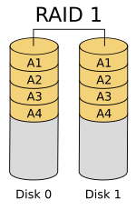
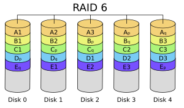
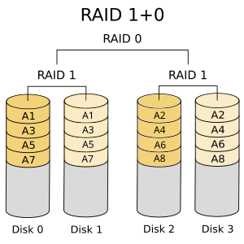
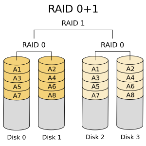

## 软件 RAID 和硬件 RAID

- 软件 RAID 的性能较低

因为其使用主机的资源。 需要加载 RAID 软件以从软件 RAID 卷中读取数据。在加载 RAID 软件前，操作系统需要引导起来才能加载 RAID 软件。在软件 RAID 中无需物理硬件。零成本投资。

- 硬件 RAID 的性能较高

采用 PCI Express 卡物理地提供有专用的 RAID 控制器。它不会使用主机资源。有 NVRAM 用于缓存的读取和写入。缓存用于 RAID 重建时，即使出现电源故障，它会使用后备的电池电源保持缓存。对于大规模使用是非常昂贵的投资。

## RAID 的概念

- 校验方式

用在 RAID 重建中从校验所保存的信息中重新生成丢失的内容。 RAID 5，RAID 6 基于校验。

- 条带化

是将切片数据随机存储到多个磁盘。它不会在单个磁盘中保存完整的数据。如果使用2个磁盘，则每个磁盘存储一半数据。

- 镜像

被用于 RAID 1 和 RAID 10。镜像会自动备份数据。在 RAID 1 中，它会保存相同的内容到其他盘上。

- 热备份

只是服务器上的一个备用驱动器，它可以自动更换发生故障的驱动器。在阵列中，如果任何一个驱动器损坏，热备份驱动器会自动用于重建 RAID。

- 块

是 RAID 控制器每次读写数据时的最小单位，最小 4KB。通过定义块大小，可以增加 I/O 性能。

## RAID 级别

- RAID0 = 条带化
- RAID1 = 镜像
- RAID5 = 单磁盘分布式奇偶校验
- RAID6 = 双磁盘分布式奇偶校验
- RAID10 = 镜像 + 条带（嵌套RAID）

### RAID 0 / 条带化

- 高性能。
- RAID 0 中容量零损失。
- 零容错。
- 写和读有很高的性能。

条带化有很好的性能。在 RAID 0（条带化）中数据将使用切片的方式被写入到磁盘。一半的内容放在一个磁盘上，另一半内容将被写入到另一个磁盘。

假设有2个磁盘驱动器，例如，如果将数据“TECMINT”写到逻辑卷中，“T”将被保存在第一盘中，“E”将保存在第二盘，'C'将被保存在第一盘，“M”将保存在第二盘，它会一直继续此循环过程。（实际上不可能按字节切片，是按数据块切片的。）

在这种情况下，如果驱动器中的任何一个发生故障，就会丢失数据，因为一个盘中只有一半的数据，不能用于重建 RAID。不过，当比较写入速度和性能时，RAID 0 是非常好的。创建 RAID 0（条带化）至少需要2个磁盘。如果数据是非常宝贵的，那么不要使用此 RAID 级别。

### RAID 1 / 镜像化

- 良好的性能。
- 总容量丢失一半可用空间。
- 完全容错。
- 重建会更快。
- 写性能变慢。
- 读性能变好。
- 能用于操作系统和小规模的数据库。

镜像也有不错的性能。镜像可以对数据做一份相同的副本。假设有两个2TB的硬盘驱动器，总共有4TB，但在镜像中，但是放在 RAID 控制器后面的驱动器形成了一个逻辑驱动器，只能看到这个逻辑驱动器有2TB。

当保存数据时，它将同时写入这两个2TB驱动器中。创建 RAID 1（镜像化）最少需要两个驱动器。如果发生磁盘故障，可以通过更换一个新的磁盘恢复 RAID 。如果在 RAID 1 中任何一个磁盘发生故障，可以从另一个磁盘中获取相同的数据，因为另外的磁盘中也有相同的数据。所以是零数据丢失。

### RAID 5 / 分布式奇偶校验

- 性能卓越。
- 读速度将非常好。
- 写速度处于平均水准，如果不使用硬件 RAID 控制器，写速度缓慢。
- 从所有驱动器的奇偶校验信息中重建。
- 完全容错。
- 1 个磁盘空间将用于奇偶校验。
- 可以被用在文件服务器，Web服务器，非常重要的备份中。

RAID 5 多用于企业级。 RAID 5 的以分布式奇偶校验的方式工作。奇偶校验信息将被用于重建数据。它从剩下的正常驱动器上的信息来重建。在驱动器发生故障时，这可以保护数据。

假设有 4 个驱动器，如果一个驱动器发生故障而后更换发生故障的驱动器后，可以从奇偶校验中重建数据到更换的驱动器上。奇偶校验信息存储在所有的 4 个驱动器上，如果有 4 个 1TB 的驱动器。奇偶校验信息将被存储在每个驱动器的 256G 中，而其它 768GB 是用户自己使用的。单个驱动器故障后，RAID 5 依旧正常工作，如果驱动器损坏个数超过 1 个会导致数据的丢失。

### RAID 6 / 双分布式奇偶校验磁盘

- 性能不佳。
- 读的性能很好。
- 如果我们不使用硬件 RAID 控制器写的性能会很差。
- 从两个奇偶校验驱动器上重建。
- 完全容错。
- 2 个磁盘空间将用于奇偶校验。
- 可用于大型阵列。
- 用于备份和视频流中，用于大规模。

RAID 6 和 RAID 5 相似但它有两个分布式奇偶校验。大多用在大数量的阵列中。最少需要 4 个驱动器，即使有 2 个驱动器发生故障，依然可以更换新的驱动器后重建数据。

它比 RAID 5 慢，因为它将数据同时写到 4 个驱动器上。当使用硬件 RAID 控制器时速度就处于平均水准。如果有 6 个的 1TB 驱动器，4 个驱动器将用于数据保存，2 个驱动器将用于校验。

### RAID 10 / 镜像+条带

- 良好的读写性能。
- 总容量丢失一半的可用空间。
- 容错。
- 从副本数据中快速重建。
- 由于其高性能和高可用性，常被用于数据库的存储中。

RAID 10 可以被称为1 + 0或0 +1。它将做镜像+条带两个工作。在 RAID 10 中首先做镜像然后做条带。在 RAID 01 上首先做条带，然后做镜像。RAID 10 比 01 好。

假设，我们有4个驱动器。当我逻辑卷上写数据时，它会使用镜像和条带的方式将数据保存到4个驱动器上。

如果我在 RAID 10 上写入数据“TECMINT”，数据将使用如下方式保存。首先将“T”同时写入两个磁盘，“E”也将同时写入另外两个磁盘，所有数据都写入两块磁盘。这样可以将每个数据复制到另外的磁盘。

同时它将使用 RAID 0 方式写入数据，遵循将“T”写入第一组盘，“E”写入第二组盘。再次将“C”写入第一组盘，“M”到第二组盘。

## 硬  RAID 管理

## 常见阵列卡

Ctrl + H 进入 WebBIOS

## 问题处理

### 磁盘降级

进入 WebBIOS 主页，发现一块硬盘显示红色 PD Missing状态，同时阵列降级变成了蓝色Degraded状态，此时数据还是可用的，点击【Physical View】进入物理视图

参考资料：<https://blog.51cto.com/tanlinhyhy/4398138>

## 参考资料

- <https://golinux.gitbooks.io/raid/content/chapter1.html>

- <https://brinnatt.com/primary/%E7%AC%AC-7-%E7%AB%A0-linux-raid-%E5%AD%98%E5%82%A8%E7%AE%A1%E7%90%86/>
