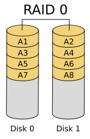

## 软件 RAID 和硬件 RAID

- 软件 RAID 的性能较低

因为其使用主机的资源。 需要加载 RAID 软件以从软件 RAID 卷中读取数据。在加载 RAID 软件前，操作系统需要引导起来才能加载 RAID 软件。在软件 RAID 中无需物理硬件。零成本投资。

- 硬件 RAID 的性能较高

采用 PCI Express 卡物理地提供有专用的 RAID 控制器。它不会使用主机资源。有 NVRAM 用于缓存的读取和写入。缓存用于 RAID 重建时，即使出现电源故障，它会使用后备的电池电源保持缓存。对于大规模使用是非常昂贵的投资。

## RAID 的概念

- 校验方式

用在 RAID 重建中从校验所保存的信息中重新生成丢失的内容。 RAID 5，RAID 6 基于校验。

- 条带化

是将切片数据随机存储到多个磁盘。它不会在单个磁盘中保存完整的数据。如果使用2个磁盘，则每个磁盘存储一半数据。

- 镜像

被用于 RAID 1 和 RAID 10。镜像会自动备份数据。在 RAID 1 中，它会保存相同的内容到其他盘上。

- 热备份

只是服务器上的一个备用驱动器，它可以自动更换发生故障的驱动器。在阵列中，如果任何一个驱动器损坏，热备份驱动器会自动用于重建 RAID。

- 块

是 RAID 控制器每次读写数据时的最小单位，最小 4KB。通过定义块大小，可以增加 I/O 性能。

## RAID 级别

- RAID0 = 条带化
- RAID1 = 镜像
- RAID5 = 单磁盘分布式奇偶校验
- RAID6 = 双磁盘分布式奇偶校验
- RAID10 = 镜像 + 条带（嵌套RAID）

### RAID 0 / 条带化

- 高性能。
- RAID 0 中容量零损失。
- 零容错。
- 写和读有很高的性能。

条带化有很好的性能。在 RAID 0（条带化）中数据将使用切片的方式被写入到磁盘。一半的内容放在一个磁盘上，另一半内容将被写入到另一个磁盘。

假设有2个磁盘驱动器，例如，如果将数据“TECMINT”写到逻辑卷中，“T”将被保存在第一盘中，“E”将保存在第二盘，'C'将被保存在第一盘，“M”将保存在第二盘，它会一直继续此循环过程。（实际上不可能按字节切片，是按数据块切片的。）

在这种情况下，如果驱动器中的任何一个发生故障，就会丢失数据，因为一个盘中只有一半的数据，不能用于重建 RAID。不过，当比较写入速度和性能时，RAID 0 是非常好的。创建 RAID 0（条带化）至少需要2个磁盘。如果数据是非常宝贵的，那么不要使用此 RAID 级别。

## 硬  RAID 管理

## 常见阵列卡

Ctrl + H 进入 WebBIOS

## 问题处理

### 磁盘降级

进入 WebBIOS 主页，发现一块硬盘显示红色 PD Missing状态，同时阵列降级变成了蓝色Degraded状态，此时数据还是可用的，点击【Physical View】进入物理视图

参考资料：<https://blog.51cto.com/tanlinhyhy/4398138>

## 参考资料

- <https://golinux.gitbooks.io/raid/content/chapter1.html>
