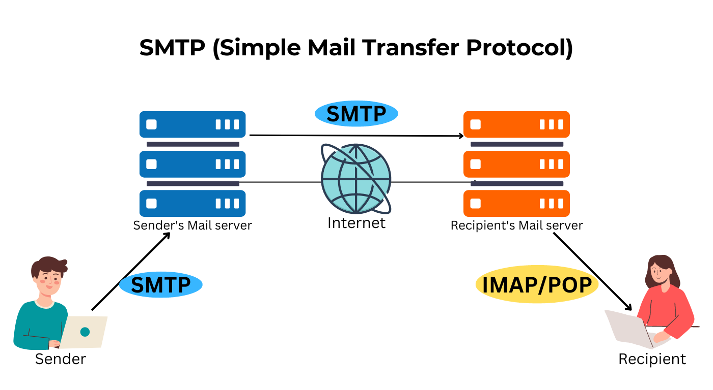
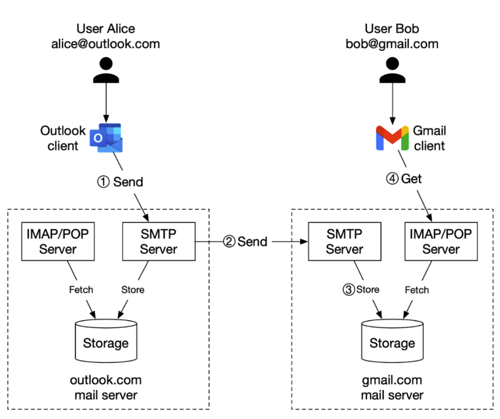

## 电子邮件

电子邮件是—种用电子手段提供信息交换的通信方式，是互联网应用最广的服务。

### 邮件服务器和电子邮箱

（1）邮件服务器：

要在 Internet 上提供电子邮件功能，必须有专门的电子邮件服务器。例如现在 Internet 很多提供邮件服务的厂商：sina、sohu、163 等等他们都有自己的邮件服务器。这些服务器类似于现实生活中的邮局，它主要负责接收用户投递过来的邮件，并把邮件投递到邮件接收者的电子邮箱中。

邮件服务器基本都由 MTA、MDA、MRA 组成

- MTA（Mail Transfer Agent） 通过 SMTP 协议发送、转发邮件，如 postfix、sendmail；

- MDA（Mail Deliver Agent）将 MTA 接收到的邮件保存到磁盘或指定地方，通常会进行垃圾邮件及病毒扫描，如 procmail、dropmail；

- MRA（Mail Receive Agent）负责实现 IMAP 与 POP3 协议，与 MUA 进行交互；

- MUA（Mail User Agent）接收邮件所使用的邮件客户端，使用 IMAP 或 POP3 协议与服务器通信，如 Foxmail、Outlook、Thunderbird；




（2）电子邮箱：

电子邮箱（E-mail地址）的获得需要在邮件服务器上进行申请 ，确切地说，电子邮箱其实就是用户在邮件服务器上申请的一个帐户。用户在邮件服务器上申请了一个帐号后，邮件服务器就会为这个帐号分配一定的空间，用户从而可以使用这个帐号以及空间，发送电子邮件和保存别人发送过来的电子邮件。

地址格式：`用户标识符+@+域名`，其中：@ 是“at”的符号，表示“在”的意思。

## 邮件传输协议

| 协议                                    | 端口     | 用途     |
| --------------------------------------- | -------- | -------- |
| SMTP (Simple Mail Transfer Protocol)    | 25 端口  | 发送邮件 |
| SMTPS (SMTP-over-SSL)                   | 465 端口 | 发送邮件 |
| IMAP (Internet Message Access Protocol) | 143 端口 | 接收邮件 |
| IMAPS (IMAP-over-SSL)                   | 993 端口 | 接收邮件 |
| POP3 (Post Office Protocol Version 3)   | 110 端口 | 接收邮件 |
| POP3S (POP3-over-SSL)                   | 995 端口 | 接收邮件 |

当通过 MUA 发送邮件时， MUA 的某个动态端口（大于 1024 ）就会与 MTA 的 25 号端口建立一个连接，邮件就会通过这个连接传送到 MTA 上，保存起来。

当通过 MUA 接收邮件时， MUA 的某个动态端口（大于 1024 ）就会与 MTA 的 110/143 端口建立连接， MTA 则将保存在服务器上的邮件发送到 MUA 上的收件箱中。



- SMTP 协议(发送邮件 Simple Mail Transfer Protocol）

SMTP 主要负责底层的邮件系统如何将邮件从一台机器传至另外一台机器。用户连上邮件服务器后，要想给它发送一封电子邮件，需要遵循一定的通迅规则，SMTP 协议就是用于定义这种通讯规则的。因而，通常我们也把处理用户 smtp 请求（邮件发送请求）的邮件服务器称之为 SMTP 服务器。

- POP3 协议 (接收邮件 Post Office Protocol  3)

用户若想从邮件服务器管理的电子邮箱中接收一封电子邮件的话，他连上邮件服务器后，也需要遵循一定的通迅格式，POP3 协议用于定义这种通讯格式。因而，通常我们也把处理用户 pop3 请求（邮件接收请求）的邮件服务器称之为 POP3 服务器。

- IMAP 协议（Internet Message Access Protocol）

互联网信息访问协议（IMAP）是一种优于 POP 的新协议。同时，IMAP 可以只下载邮件的主题，只有当您真正需要的时候，才会下载邮件的所有内容。

和 POP 一样，IMAP 也能下载邮件、从服务器中删除邮件或询问是否有新邮件，但 IMAP 克服了 POP 的一些缺点。例如

（1）它可以决定客户机请求邮件服务器提交所收到邮件的方式

（2）请求邮件服务器只下载所选中的邮件而不是全部邮件。

（3）客户机可先阅读邮件信息的标题和发送者的名字再决定是否下载这个邮件。

（4）通过用户的客户机电子邮件程序，IMAP 可让用户在服务器上创建并管理邮件文件夹或邮箱、删除邮件、查询某封信的一部分或全部内容，完成所有这些工作时都不需要把邮件从服务器下载到用户的个人计算机上。

- MIME 协议（Multipurpose Internet Mail Extension，多用途 Internet 邮件扩展）

多用途 Internet 邮件扩展 (Multipurpose Internet Mail Extensions) 协议。作为对 SMTP 协议的扩充，MIME 规定了通过 SMTP 协议传输非文本电子邮件附件的标准。

MIME 规定了应用消息的格式，MIME 基本由两部分组成，首部不能是空行，一旦出现空行，之后的内容就会被自动认定为正文。在 MIME 首部中的 “Content-Type” 中指出了传输信息的格式。

## SMTP 协议

SMTP（Simple Mail Transfer Protocol，简单邮件传输协议）定义了邮件客户端与 SMTP 服务器之间，以及两台 SMTP 服务器之间发送邮件的通信规则 。SMTP 协议属于 TCP/IP 协议族，通信双方采用一问一答的命令 / 响应形式进行对话，且定了对话的规则和所有命令 / 响应的语法格式。

SMTP 协议中一共定了 18 条命令，发送一封电子邮件的过程通常只需要其中的 6 条命令即可完成发送邮件的功能，下表按照发送命令的先后顺序列出了这 6 条命令，并描述了其语法及功能说明，其中，`<SP>` 代表空格，`<CRLF>` 代表回车和换行。

| **SMTP命令格式**                    | **说明**                                                     |
| ----------------------------------- | ------------------------------------------------------------ |
| `ehlo<SP><domain><CRLF>`            | ehlo 命令是 SMTP 邮件发送程序与 SMTP 邮件接收程序建立连接后必须发送的第一条 SMTP 命令，参数 `<domain>` 表示 SMTP 邮件发送者的主机名。 ehlo 命令用于替代传统 SMTP 协议中的 helo 命令 |
| `auth<SP><para><CRLF>`              | 如果 SMTP 邮件接收程序需要 SMTP 邮件发送程序进行认证时，它会向 SMTP 邮件发送程序提示它所采用的认证方式，SMTP 邮件发送程序接着应该使用这个命令回应 SMTP 邮件接收程序，参数 `<para>` 表示回应的认证方式，通常是 SMTP 邮件接收程序先前提示的认证方式 |
| `mail<SP>From:<reverse-path><CRLF>` | 此命令用于指定邮件发送者的邮箱地址，参数 `<reverse-path>` 表示发件人的邮箱地址 |
| `rcpt<SP>To:<forword-path><CRLF>`   | 此命令用于指定邮件接收者的邮箱地址，参数 `<forward-path>` 表示接收者的邮箱地址。如果邮件要发送给多个接收者，那么应使用多条 `rcpt<SP>To` 命令来分别指定每一个接收者的邮箱地址 |
| `data<CRLF>`                        | 此命令用于表示 SMTP 邮件发送程序准备开始输入邮件内容，在这个命令后面发送的所有数据都将被当做邮件内容，直至遇到“`<CRLF>.<CRLF>`"标志符，则表示邮件内容结束 |
| `quit<CRLF>`                        | 此命令表示要结束邮件发送过程，SMTP 邮件接收程序接收到此命令后，将关闭与 SMTP 邮件发送程序的网络连接 |

对于 SMTP 邮件发送程序发送的每一条命令，SMTP 邮件接收程序都将回应一条响应信息。每条响应信息都以一个响应状态开头，如：250  OK。响应状态用于表示 SMTP 服务器对请求命令的处理结果和状态，它是一个三位的十进制数。响应状态码的最高位数字代表了不同的分类，当其为 2 时表示命令执行成功；为 5 时表示命令执行失败；为 3 时表示命令没有完成。关于响应状态码所代表的具体含义，可以参考[RFC821](http://james.apache.org/server/rfclist/smtp/rfc0821.txt)文档。

其它 SMTP 命令的语法及功能描述可以参考[RFC821](http://james.apache.org/server/rfclist/smtp/rfc0821.txt)和[RFC1869](http://www.ietf.org/rfc/rfc1869.txt)文档。

## POP3 协议

邮件服务提供商专门为每个用户申请的电子邮箱提供了专门的邮件存储空间，SMTP服务器将接收到的电子邮件保存到相应用户的电子邮箱中。用户要从邮件服务提供商提供的电子邮箱中获取自己的电子邮件，就需要通过邮件服务提供商的POP3邮件服务器来帮助完成。POP3(Post Office Protocol 邮局协议的第三版本)协议定义了邮件客户端程序与POP3服务器进行通信的具体规则和细节。

POP3 协议在[RFC 1939](http://www.ietf.org/rfc/rfc1939.txt)文档中定义，它采用的网络监听端口号默认为 110。POP3 协议共定义了 12 条 POP3 命令，邮件客户端程序通过这些命令来检索和获取用户电子邮箱中的邮件信息。下表列举出了这 12 条 POP3 命令及其说明，其中，`<SP>` 代表空格，`<CRLF>` 代表回车和换行。

| **POP3命令格式**            | **说明**                                                     |
| --------------------------- | ------------------------------------------------------------ |
| `user<SP>username<CRLF>`    | user 命令是 POP3 客户端程序与 POP3 邮件服务器建立连接后通常发送的第一条命令，参数 username 表示收件人的帐户名称。 |
| `pass<SP>password<CRLF>`    | pass 命令是在 user 命令成功通过后，POP3 客户端程序接着发送的命令，它用于传递帐户的密码，参数 password 表示帐户的密码。 |
| `apop<SP>name,digest<CRLF>` | apop 命令用于替代 user 和 pass 命令，它以 MD5 数字摘要的形式向 POP3 邮件服务器提交帐户密码。 |
| `stat<CRLF>`                | stat 命令用于查询邮箱中的统计信息，例如：邮箱中的邮件数量和邮件占用的字节大小等。 |
| `uidl<SP>msg#<CRLF>`        | uidl 命令用于查询某封邮件的唯一标志符，参数 `msg#` 表示邮件的序号，是一个从 1 开始编号的数字。 |
| `list<SP>[MSG#]<CRLF>`      | list 命令用于列出邮箱中的邮件信息，参数 `msg#` 是一个可选参数，表示邮件的序号。当不指定参数时，POP3 服务器列出邮箱中所有的邮件信息；当指定参数 `msg#` 时，POP3 服务器只返回序号对应的邮件信息。 |
| `retr<SP>msg#<CRLF>`        | retr 命令用于获取某封邮件的内容，参数 `msg#` 表示邮件的序号。 |
| `dele<SP>msg#<CRLF>`        | dele 命令用于在某封邮件上设置删除标记，参数 `msg#` 表示邮件的序号。POP3 服务器执行 dele 命令时，只是为邮件设置了删除标记，并没有真正把邮件删除掉，只有 POP3 客户端发出 quit 命令后，POP3 服务器才会真正删除所有设置了删除标记的邮件。 |
| `rest<CRLF>`                | rest 命令用于清除所有邮件的删除标记。                        |
| `top<SP>msg#<SP>n<CRLF>`    | top 命令用于获取某封邮件的邮件头和邮件体中的前 n 行内容，参数 msg# 表示邮件的序号，参数 n 表示要返回邮件的前几行内容。使用这条命令以提高 Web Mail 系统（通过 Web 站点上收发邮件）中的邮件列表显示的处理效率，因为这种情况下不需要获取每封邮件的完整内容，而是仅仅需要获取每封邮件的邮件头信息。 |
| `noop<CRLF>`                | noop 命令用于检测 POP3 客户端与 POP3 服务器的连接情况。      |
| `quit<CRLF>`                | quit 命令表示要结束邮件接收过程，POP3 服务器接收到此命令后，将删除所有设置了删除标记的邮件，并关闭与 POP3 客户端程序的网络连接。 |

对于 POP3 客户程序发送的每一条 POP3 命令，POP3 服务器都将回应一些响应信息。响应信息由一行或多行文本信息组成，其中的第一行始终以“`+OK`” 或 “`-ERR`” 开头，它们分别表示当前命令执行成功或执行失败。

## IMAP 协议

IMAP（Internet Message Access Protocol）协议是对 POP3 协议的一种扩展，定了邮件客户端软件与邮件服务器的通信规则。IMAP协议在[RFC2060](http://james.apache.org/server/rfclist/imap4/rfc2060.txt)文档中定义，目前使用的是第 4 个版本，所以也称为 IMAP4。IMAP 协议相对于 POP3 协议而言，它定了更为强大的邮件接收功能，主要体现在以下一些方面：

1. IMAP 具有摘要浏览功能，可以让用户在读完所有邮件的主题、发件人、大小等信息后，再由用户做出是否下载或直接在服务器上删除的决定。
2. IMAP 可以让用户有选择性地下载邮件附件。例如一封邮件包含 3 个附件，如果用户确定其中只有 2 个附件对自已有用，就可只下载这 2 个附件，而不必下载整封邮件，从而节省了下载时间。
3. IMAP 可以让用户在邮件服务器上创建自己的邮件夹，分类保存各个邮件

## MIME 协议

在以往的邮件发送协议[RFC822](http://www.w3.org/Protocols/rfc822/)文档中定义，只能发送文本信息，无法发送非文本的邮件，针对这个问题，人们后来专门为此定义了MIME（Multipurpose Internet Mail Extension，多用途Internet邮件扩展）协议。

MIME 协议用于定义复杂的邮件体格式，它可以表达多段平行的文本内容和非文本的邮件内容，例如，在邮件体中内嵌的图像数据和邮件附件等。另外，MIME 协议的数据格式也可以避免邮件内容在传输过程发生信息丢失。对于表示某个具体资源的 MIME 消息，它的消息头中需要指定资源的数据类型；对于 MIME 组合消息，它的消息中需要指定组合关系。

具体资源的数据类型和组合消息的组合关系，都是通过消息头中的 Content-Type 头字段来指定的。Content-Type 字段中的内容以 “主类型 / 子类型” 的形式出现，主类型有 text、image、audio、video、application、multipart、message 等，分别表示文本、图片、音频、视频、应用程序、组合结构、消息等。每个主类型下面都有多个子类型，例如 text 类型包含 plain、html、xml、css 等子类型。multipart 主类型用于表示 MIME 组合消息，它是 MIME 协议中最重要的一种类型。一封 MIME 邮件中的 MIME 消息可以有三种组合关系：混合、关联、选择，它们对应 MIME 类型如下：

- `multipart/mixed`

表示消息体中的内容是混和组合类型，内容可以是文本、声音和附件等不同邮件内容的混和体。比如一封邮件中即包含附件，邮件内容还引用内嵌的图片或附件资源，这种类型邮件的MIME类型就必须定义为 `multipart/mixed`。

- `multipart/related`

表示消息体中的内容是关联（依赖）组合类型。比如：邮件内容有一个 img 标签，这个标签的 src 属性指向的是邮件内部的一个图片资源，所以这封邮件 MIME 类型就应该定义为 `multipart/related`

- `multipart/alternative`

表示消息体中的内容是选择组合类型，例如一封邮件的邮件正文同时采用 HTML 格式和普通文本格式进行表达时，就可以将它们嵌套在一个 `multipart/alterntive` 类型的组合消息中。这种做法的好处在于如果邮件阅读程序不支持 HTML 格式时，可以采用其中的文本格式进行替代。

## ESMPT 协议

ESMTP (Extended SMTP)，顾名思义，扩展 SMTP 就是对标准 SMTP 协议进行的扩展。 它与 SMTP 服务的区别仅仅是，使用 SMTP 发信不需要验证用户帐户，而用 ESMTP 发信时， 服务器会要求用户提供用户名和密码以便验证身份

SMTP 命令包括：

- HELO 向服务器标识用户身份。发送者能欺骗，说谎，但一般情况下服务器都能检测到。
- EHLO 向服务器标识用户身份。发送者能欺骗，说谎，但一般情况下服务器都能检测到。
- MAIL FROM 命令中指定的地址是发件人地址
- RCPT TO 标识单个的邮件接收人；可有多个 RCPT TO；常在 MAIL 命令后面。
- DATA 在单个或多个 RCPT 命令后，表示任何的邮件接收人已标识，并初始化数据传输，以 CRLF.CRLF 结束
- VRFY 用于验证指定的用户/邮箱是否存在；由于安全面的原因，服务器常禁止此命令
- EXPN 验证给定的邮箱列表是否存在，扩充邮箱列表，也常被禁用
- HELP 查询服务器支持什么命令
- NOOP 无操作，服务器应响应 OK
- RSET 重置会话，当前传输被取消
- QUIT 结束会话

## DNS

### A/AAAA 记录

使用了 `mail.alpha-quant.tech` 来指示邮件服务器，因此需要添加一条指向邮件服务器 IP 的 A 记录来实现解析

### MX 记录

MX 记录标记了对本域名负责的邮件服务器地址，以便想给你发信的人找到投递目标。在这里需要添加一条 Host 为 `alpha-quant.tech`，指向 `mail.alpha-quant.tech` 的 MX 记录。这条记录含义为 `*@alpha-quant.tech` 的邮件由 `mail.alpha-quant.tech` 负责。

| TYPE | HOST                  | ANSWER                |
| ---- | --------------------- | --------------------- |
| A    | mail.alpha-quant.tech | <MAIL_SERVER_IP>      |
| MX   | alpha-quant.tech      | mail.alpha-quant.tech |

有了这两条记录，就准备好接收信件了。任何人发往 `*@alpha-quant.tech` 的邮件应当能被正确指引到刚刚启动的邮件服务器

mailserver 并不是来者不拒照单全收，而是会通过各种手段检查发信方的身份。当发信的时候，收信方往往也会进行同样的甚至更严格的检查。为了不让发出的信件被丢进垃圾桶，需要一条 rDNS 和一些特殊格式的 TXT 记录证明 “我就是我”

### rDNS

rDNS 的设置并不在你的域名管理处，而是在你的主机管理处。普通 DNS 查询域名返回 IP，rDNS 则是查询 IP 返回域名。当服务器收到邮件时，会通过 rDNS 查询来源服务器的 IP，比对返回结果与 HELO。不匹配的邮件会被认为是可疑的。

如果你的主机管理面板没有设置 rDNS 的地方，你可能需要咨询主机提供商客服。在这里，将承载邮件服务器的主机的 rDNS 设为 `mail.alpha-quant.tech`，和上文设置的 A 记录遥相呼应

测试

```
$ dig @1.1.1.1 +short MX alpha-quant.tech
mail.alpha-quant.tech
$ dig @1.1.1.1 +short A mail.alpha-quant.tech
11.22.33.44
$ dig @1.1.1.1 +short -x 11.22.33.44
mail.alpha-quant.tech
```

### SPF

SPF 记录用于指定哪些服务器是指定的发信服务器，以阻止伪造的信件。

SPF（Sender Policy Framework） 是电子邮件系统中发送方策略框架的缩写，它的内容写在 DNS 的 txt 类型的记录里面；作用是防止别人伪造你的邮件地址进行发信，是一种非常高效的反垃圾邮件解决方案

SPF 记录实际上是服务器的一个 DNS 记录，原理其实很简单：假设邮件服务器收到了一封邮件，来自主机的 IP 是`222.91.123.220`，并且声称发件人为`email@example.com`。为了确认发件人不是伪造的，邮件服务器会去查询`example.com`的 SPF 记录。如果该域的 SPF 记录设置允许 IP 为`222.91.123.200`的主机发送邮件，则服务器就认为这封邮件是合法的；如果不允许，则通常会退信，或将其标记为垃圾/仿冒邮件。钓鱼邮件虽然可以「声称」他的邮件来自`example.com`，但是他却无权操作`example.com`的 DNS 记录；同时他也无法伪造自己的 IP 地址。

向 `alpha-quant.tech` 添加一条值为 `v=spf1 mx ~all` 的 TXT 记录，我们就完成了 SPF 配置。这条记录的含义是：

- 这是一条需要使用 spf1 语法解析的记录
- 允许 MX 记录指向的服务器发信（在这里是 `mail.alpha-quant.tech`）
- 对其余所有来源软拒绝（标记为可疑邮件）

在设置这条记录后，仅有来源于 MX 的发信能够通过 SPF 检查。如果你需要从多个服务器发信，可以按 SPF 记录语法加入所需的其他服务器

```bash
"v=spf1 mx mx:alpha-quant.tech -all"
# 允许当前域名和 alpha-quant.tech 的 mx 记录对应的 IP 地址。
```

例如：

- `"v=spf1 mx -all"`

允许当前域名的 mx 记录对应的 IP 地址。

- `"v=spf1 mx mx:deferrals.example.com -all"`

允许当前域名和 `deferrals.example.com` 的 mx 记录对应的 IP 地址。

- `"v=spf1 a/24 -all"`

类似地，这个用法则允许一个地址段。

- `v=spf1 a mx ip4:173.194.72.103 -all`

这是一个比较常见的 SPF 记录，它表示支持当前域名的 a 记录和 mx 记录，同时支持一个给定的 IP 地址；其他地址则拒绝

- `"v=spf1 include:example.com -all"`

即采用和 example.com 完全一样的 SPF 记录

### DKIM

DKIM（DomainKeys Identified Mail）是一种电子邮件验证方法，用于帮助检测电子邮件中的伪造和篡改行为，以此来提高邮件的安全性和信任度。这种技术允许发件人通过使用数字签名来证明邮件确实是由其声称的发件域名所发送，并且邮件的内容没有在传输过程中被篡改。

相较于 SPF，DKIM 是更进一步的身份验证。DKIM 使用了与 SSL 证书类似的非对称机制，但通过 TXT 记录取代了 CA 的位置。我们通过一条符合 DKIM 语法的 TXT 记录发布公钥，在发信时附上私钥的签名。收信人通过 DNS 查询获得公钥验签，以确认发信人权威性。

在设置记录前，需要先生成用于 DKIM 的密钥对。在这里指定使用 2048 位长度，因为默认的 4096 位可能存在兼容性问题

```bash
docker compose exec -ti mailserver setup config dkim keysize 2048
cat docker-data/dms/config/opendkim/keys/alpha-quant.tech/mail.txt
```

此时你应该看到形如 `mail._domainkey IN TXT ( "v=DKIM1; h=sha256; k=rsa; ...")` 的输出，这就是需要添加的记录。考虑到部分 DNS 限制 TXT 记录长度，记录被拆成三行。建议将双引号内的值连接成一条后添加，避免出现问题

根据文件指示，添加一条 host 为 `mail._domainkey.alpha-quant.tech`，值为 `v=DKIM1; h=sha256; k=rsa;p=XXXX` 的记录。添加完毕后可以通过 [MX Toolbox DKIM Lookup](https://mxtoolbox.com/dkim.aspx) 来验证格式是否正确

当一封电子邮件被发送时，如果启用了DKIM，发送服务器会为邮件添加一个DKIM签名头部。这个DKIM签名包括了用于验证邮件的信息，其中关键的部分包括签名（使用私钥生成）和选择器（selector）。选择器是用来识别特定的DKIM公钥记录的一个唯一的字符串标识。

这里是一个典型的电子邮件中的DKIM签名头部示例：

```bash
DKIM-Signature: v=1; a=rsa-sha256; d=example.com; s=default; c=relaxed/relaxed;
h=from:to:subject:date:message-id; i=@example.com;
bh=...; b=...;
```

在这个头部中：

- `v=1`表示DKIM版本。
- `a=rsa-sha256`表示签名算法。
- `d=example.com`表示发送域。
- `s=default`表示用于签名的选择器。
- `c=relaxed/relaxed`表示规范化算法。
- `h=from:to:subject:date:message-id`表示被签名的头部字段。
- `i=@example.com`表示签名身份。
- `bh=`后面的部分是邮件正文的哈希值。
- `b=`后面的部分是签名本身。

当收信方服务器接收到这封电子邮件时，它会查看`DKIM-Signature`头部，找到`d=`（域）和`s=`（选择器）的值。这两个值告诉收信方服务器去哪个DNS记录中查找相应的公钥。

收信方服务器会根据发送域（`d=example.com`）和选择器（比如`default`）构造一个DNS查询，形如：

```bash
default._domainkey.example.com
```

然后收信方服务器查询这个DNS记录，获取公钥，用这个公钥来验证签名`b=`的有效性。如果签名验证成功，那么可以认为这封邮件确实来自声称的域，并且在传输途中未被篡改。

如果一个域名有多个发送源，每个源都应该使用不同的选择器，这样收信方就可以通过每封邮件的`DKIM-Signature`头部中的选择器来找到正确的公钥。

### DMARC

DMARC 用于指导收件人应当如何处理未通过 SPF/DKIM 认证的邮件。当服务器收到来自本域名却未通过认证的邮件，会按照 DMARC 指示处理可疑邮件并汇报。如果有坏蛋在伪装我们发信，我们可以通过报告察觉到这种行为。

可以使用这个工具 <https://dmarcguide.globalcyberalliance.org/#/?lang=zh-CN> 来生成适合你的 DMARC。或者直接使用如下片段，修改 ruf 和 rua 为自己的回报地址

```bash
_dmarc IN TXT "v=DMARC1; p=quarantine; rua=mailto:dmarc.report@example.com; ruf=mailto:dmarc.report@example.com; fo=0; adkim=r; aspf=r; pct=100; rf=afrf; ri=86400; sp=quarantine"
```

将引号内的片段作为值，添加一条 host 为`_dmarc.alpha-quant.tech` 的 TXT 记录。上述工具也可以用于验证你的 DMARC 设置是否正确

### SFP&DKIM&DMARC

| TYPE | HOST                             | ANSWER                                                       |
| ---- | -------------------------------- | ------------------------------------------------------------ |
| TXT  | alpha-quant.tech                 | v=spf1 mx include:alpha-quant.tech ~all                      |
| TXT  | _dmarc.alpha-quant.tech          | v=DMARC1; p=quarantine; rua=mailto:dmarc.report@alpha-quant.tech; ruf=mailto:dmarc.report@alpha-quant.tech; sp=quarantine; ri=86400 |
| TXT  | mail._domainkey.alpha-quant.tech | v=DKIM1; h=sha256; k=rsa;p=MII…LONG_PUBLIC_KEY…QAB           |

加上这三条 TXT 记录和一条 rDNS 记录，我们应当已经有能力证明 “我是我” 这件事

## 参考资料

- <https://blog.stellaris.wang/p/experience/mail-server/>

- <https://blog.csdn.net/weixin_37813152/article/details/134557711>

- <https://www.cnblogs.com/diegodu/p/4097202.html>

- <https://www.cnblogs.com/antLaddie/p/15546365.html>