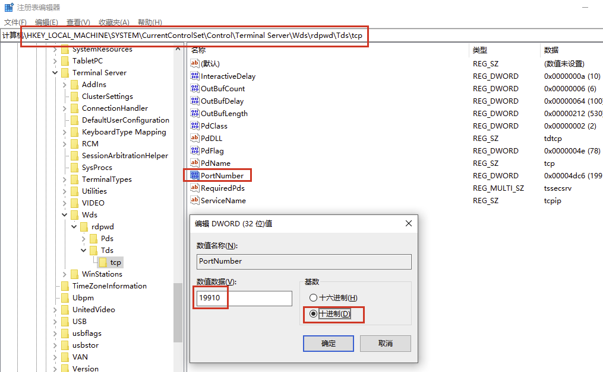
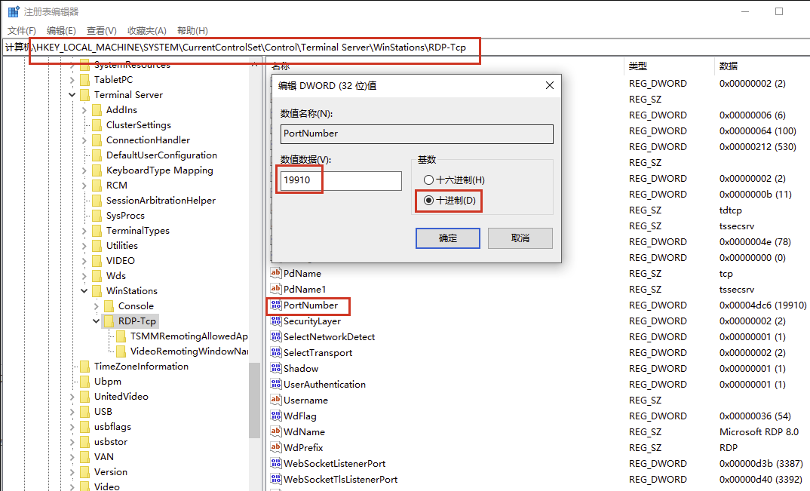
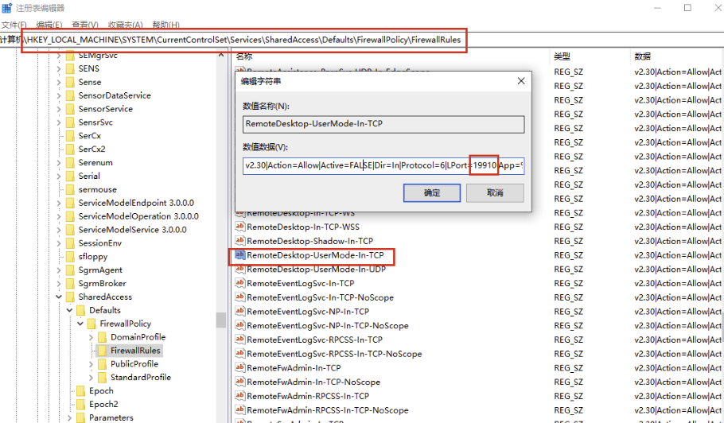
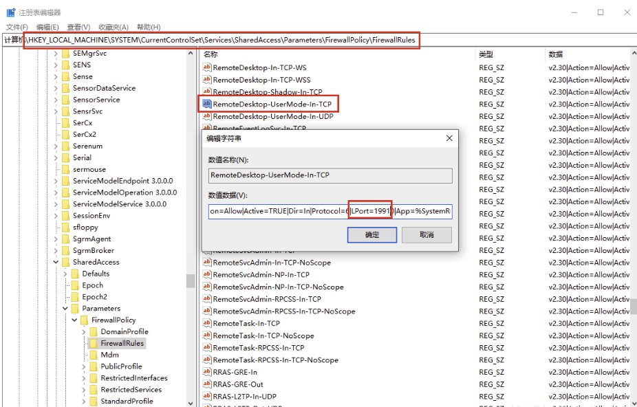
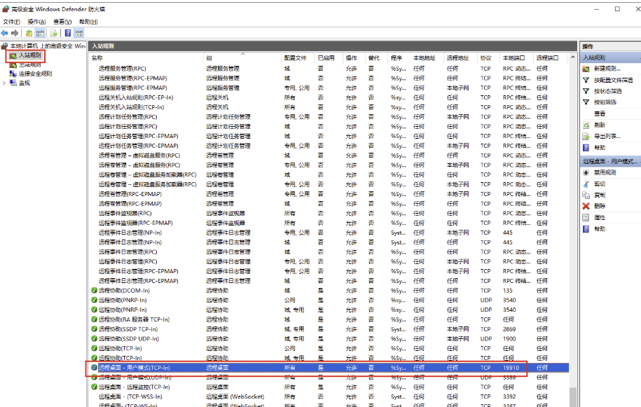

## 修改注册表以更改端口

```
 \HKEY_LOCAL_MACHINE\SYSTEM\CurrentControlSet\Control\Terminal Server\Wds\rdpwd\Tds\tcp
```

选择 PortNumber 进行修改



```
\HKEY_LOCAL_MACHINE\SYSTEM\CurrentControlSet\Control\Terminal Server\WinStations\RDP-Tcp
```



## 防火墙修改

特别注意：如果系统开启了防火墙，仅通过以上的操作，重启电脑后，新的端口依然无法生效，此时防火墙中，远程桌面的入站规则端口还是3389

```bash
\HKEY_LOCAL_MACHINE\SYSTEM\CurrentControlSet\Services\SharedAccess\Defaults\FirewallPolicy\FirewallRules
```

找到 RemoteDesktop-UserMode-In-TCP



```
\HKEY_LOCAL_MACHINE\SYSTEM\CurrentControlSet\Services\SharedAccess\Parameters\FirewallPolicy\FirewallRules
```



打开控制面版，进入系统和安全 > Windows Defender 防火墙，选择高级设置，可在入站规则中，查看到远程桌面的本地端口已修改为19910



## 使得新端口生效

使用 Win + R 调出运行窗口，输入 services.msc 打开服务，找到 Remote Desktop Services，重启动此服务

