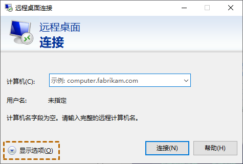
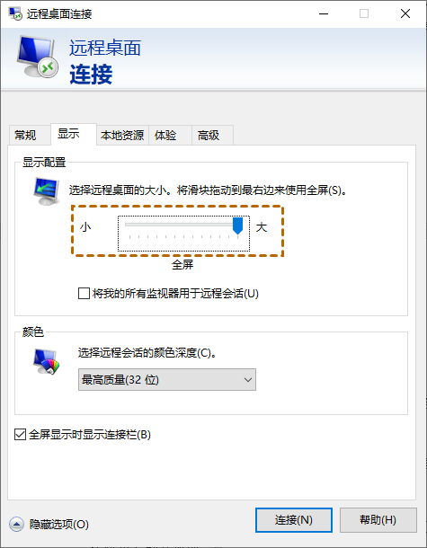
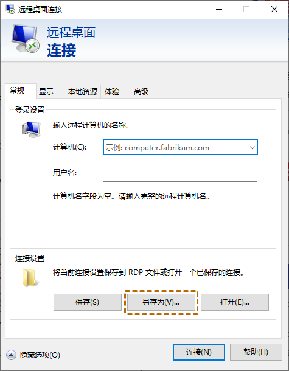
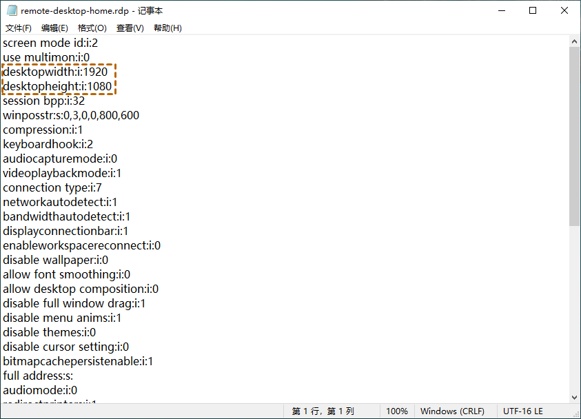

## 更改 RDP 分辨率

### 直接更改

在“远程桌面连接”窗口中编辑显示配置，以调整远程桌面的分辨率。

切换到“显示”选项卡，找到显示配置，会在中间看到一个滑块，然后滑动滑块以选择想要的分辨率。

### 保存为 RDP 文件

打开远程桌面连接，在“常规”选项卡上，找到“连接设置”并单击“另存为”。

在记事本中打开文件后，您可以将“desktopwidth”和“desktopheight”调整为所需的像素。例如，设置为1920x1080。

## 参考资料

- <https://www.anyviewer.cn/how-to/change-screen-resolution-remote-desktop-2111.html>