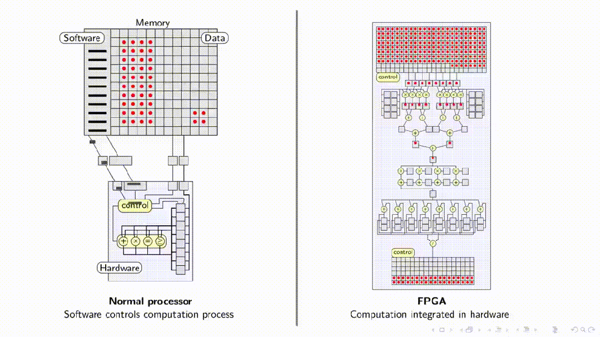

CPU：数据处理由软件控制，CPU从内存（Memory）中逐个读取数据（红点）并执行指令，送入硬件（Hardware）部分进行处理，“control”单元负责协调数据读取和运算，确保按照正确的顺序进行。CPU处理过程具有高度的灵活性和通用性。

- 优点： 通用性强，编程相对容易，适合处理复杂和动态变化的计算任务。
- 缺点： 数据需要通过软件指令按顺序处理，速度相对较慢，并行处理能力有限，能耗较高。

FPGA： 数据处理通过硬件电路实现，数据流直接在硬件中进行（控制指令硬件化），可以并行处理，具有更高的处理速度和效率。也有一个“control”区域，但它主要是负责控制硬件电路的运行，而非像CPU那样控制计算过程。

- 优点： 处理速度快，可以并行处理大量数据，能耗较低，适合处理重复性高、计算密集型的任务。
- 缺点： 编程难度高，灵活性相对较差，不适合处理复杂的、动态变化的计算任务。