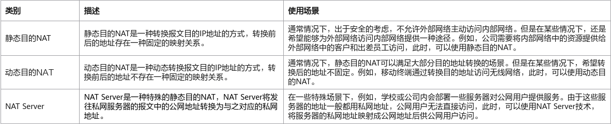
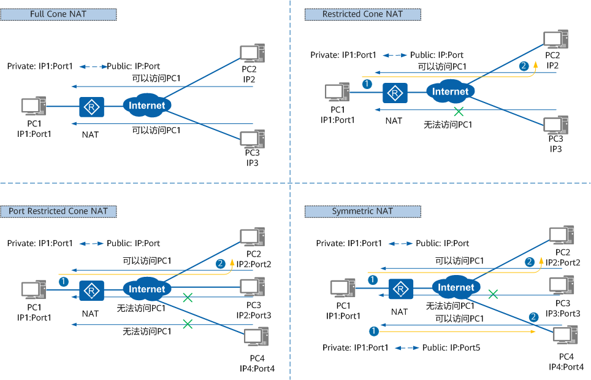

## NAT

### NAT 简介

NAT 是一种地址转换技术，它可以将 IP 数据报文头中的 IP 地址转换为另一个 IP 地址，并通过转换端口号达到地址重用的目的。NAT 作为一种缓解 IPv4 公网地址枯竭的过渡技术，由于实现简单，得到了广泛应用。

可以将内网地址（私有 IP 地址）转换为公网地址（公有 IP 地址），用于缓解 IPv4 地址不够用的问题，一般部署在连接内网和外网的边界设备上（路由器，防火墙）

- 内部本地地址

转换前的内部主机的 IP 地址（私有地址）

- 内部全局地址

转换后的主机地址（公有地址）

- 外部本地 / 全局地址

针对于内网用户来说，不知道外网地址是否进行转换，在 NAT 表项中体现的是一样的

### NAT 转换过程

NAT 设备从内网接口收到一个数据包的时候，会结合 ACL 判断数据包的源 IP 是否需要进行 NAT 转换，如果需要，根据 NAT 的配置进行相对应的 NAT 转换，然后设备会将转换后的数据包发到公网环境当中

## NAT 的分类

根据 NAT 转换是对报文中的源地址进行转换还是对目的地址进行转换，NAT 可以分为源 NAT、目的 NAT 和双向 NAT。

### DNAT（目的 NAT）

目的 NAT 在 NAT 转换时，仅对报文中的目的地址和目的端口号进行转换，主要应用于公网用户访问私网服务的场景。当公网用户主机发送的报文到达 NAT 设备后，设备通过目的 NAT 技术将报文中的公网 IPv4 地址转换成私网 IPv4 地址，从而使公网用户可以使用公网地址访问私网服务。

根据转换前后的地址是否存在一种固定的映射关系，目的 NAT 可以细分为如下几种类型



思科：

```bash
//静态NAT
R1(config)#int e0/0
R1(config-if)#ip nat inside //定义内接口
R1(config-if)#int e0/1
R1(config-if)#ip nat outside //定义外接口
设置允许上网的地址并进行NAT转换（将192.168.10.1和202.101.10.10进行映射）
R1(config)#ip nat inside source static 192.168.10.1 202.101.10.10

//动态NAT
R1(config)#int e0/0
R1(config-if)#ip nat inside 
R1(config-if)#int e0/1
R1(config-if)#ip nat outside 
R1(config-if)#exit
R1(config)#access-list 1 permit 192.168.10.0 0.0.0.255
R1(config)#ip nat pool a 202.101.10.20 202.101.10.21 netmask 255.255.255.0
```

华为 /H3C：

```bash
//静态NAT
[Huawei] interface Ethernet0/0/1 //外接口
[Huawei-GigabitEthernet0/0/1] ip address 202.101.12.1 255.255.255.0
[Huawei-GigabitEthernet0/0/1] nat static global 202.101.12.10 inside 192.168.10.1

//动态NAT
[Huawei] nat address-group 1 202.101.12.10 202.101.12.11
[Huawei] acl 2000
[Huawei-acl-basic-2000] rule permit source 192.168.10.0 0.0.0.255
[Huawei-acl-basic-2000] quit
[Huawei] int g0/0/1
[Huawei-GigabitEthernet0/0/1] nat outbound 2000 address-group 1 no-pat 

//NAT Server
[R1-GigabitEthernet0/0/1] nat server protocol tcp global 202.10.10.1 8080 inside 192.168.1.1 www
```

### SNAT（源 NAT）

源 NAT 在 NAT 转换时，仅对报文中的源地址进行转换，主要应用于私网用户访问公网的场景。当私网用户主机访问 Internet 时，私网用户主机发送的报文到达 NAT 设备后，设备通过源 NAT 技术将报文中的私网 IPv4 地址转换成公网 IPv4 地址，从而使私网用户可以正常访问 Internet。

根据转换时是否同时转换源端口号，源 NAT 可以细分为如下几种类型


思科：

```bash
//Easy IP
R1(config)#ip nat inside source list 1 pool a overload 

//NAPT
R1(config)#ip nat inside source list 1 pool a overload 
```

华为 /H3C：

```bash
//Easy IP
acl  2000
rule  permit source 192.168.10.0 0.0.0.255
[Huawei-acl-basic-2000]int e0/0/1
[Huawei-Ethernet0/0/1]nat outbound 2000  

//NAPT
[Huawei-GigabitEthernet0/0/1]nat outbound 2000 address-group 1 
```

### 双向 NAT

双向 NAT 指的是在转换过程中同时转换报文的源信息和目的信息。双向 NAT 不是一个单独的功能，而是源 NAT 和目的 NAT 的组合。双向 NAT 是针对同一条流，在其经过设备时同时转换报文的源地址和目的地址。双向 NAT 主要应用在同时有外网用户访问内部服务器和私网用户访问内部服务器的场景。

#### STUN 中定义的 NAT 类型

在 STUN 标准中，根据私网 IP 地址和端口到 NAT 出口的公网 IP 地址和端口的映射方式，把 NAT 分为如下四种类型，详见下图。



- Full Cone NAT（完全锥型 NAT）

  所有从同一个私网 IP 地址和端口（IP1:Port1）发送过来的请求都会被映射成同一个公网 IP 地址和端口（IP:Port）。并且，任何外部主机通过向映射的公网 IP 地址和端口发送报文，都可以实现和内部主机进行通信。

  这是一种比较宽松的策略，只要建立了私网 IP 地址和端口与公网 IP 地址和端口的映射关系，所有的 Internet 上的主机都可以访问该 NAT 之后的主机。

- Restricted Cone NAT（限制锥型 NAT）

  所有从同一个私网 IP 地址和端口（IP1:Port1）发送过来的请求都会被映射成同一个公网 IP 和端口号（IP:Port）。与完全锥型 NAT 不同的是，当且仅当内部主机之前已经向公网主机发送过报文，此时公网主机才能向私网主机发送报文。

- Port Restricted Cone NAT（端口限制锥型 NAT）

  与限制锥型 NAT 很相似，只不过它包括端口号。也就是说，一台公网主机（IP2:Port2）想给私网主机发送报文，必须是这台私网主机先前已经给这个 IP 地址和端口发送过报文。

- Symmetric NAT（对称 NAT）

  所有从同一个私网 IP 地址和端口发送到一个特定的目的 IP 地址和端口的请求，都会被映射到同一个 IP 地址和端口。如果同一台主机使用相同的源地址和端口号发送报文，但是发往不同的目的地，NAT 将会使用不同的映射。此外，只有收到数据的公网主机才可以反过来向私网主机发送报文。

  这和端口限制锥型 NAT 不同，端口限制锥型 NAT 是所有请求映射到相同的公网 IP 地址和端口，而对称 NAT 是不同的请求有不同的映射。