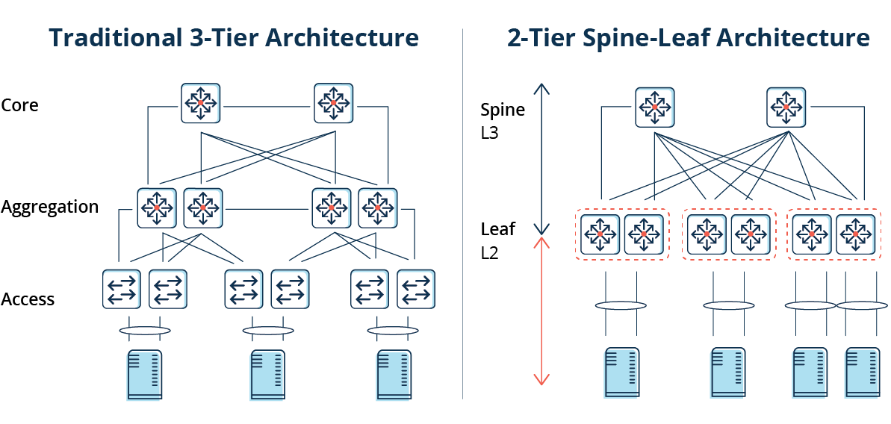

## BGP 简介

边界网关协议（Border Gateway Protocol，BGP）是一种用来在路由选择域之间交换网络层可达性信息（Network Layer Reachability Information，NLRI）的路由选择协议

BGP（Border Gateway Protocol，边界网关协议）是一种用于 AS（Autonomous System，自治系统）之间的动态路由协议。BGP 协议提供了丰富灵活的路由控制策略，早期主要用于互联网 AS 之间的互联。随着技术的发展，现在 BGP 协议在数据中心也得到了广泛的应用，现代数据中心网络通常是基于 Spine-Leaf 架构，其中 BGP 可用于传播端点的可达性信息

BGP 边界网络协议采用 TCP 179 端口

Leaf 层由接入交换机组成，这些交换机会对来自服务器的流量进行汇聚并直接连接到 Spine 或网络核心，Spine 交换机以一种全网格拓扑与所有 Leaf 交换机实现互连

