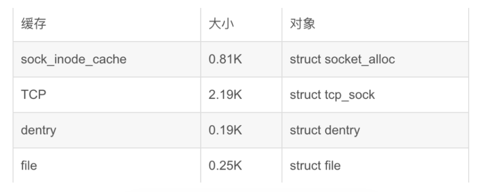

TCP 连接本质上在内核里就是一个 socket 对象

```c
struct socket {  
    ....
    //INET域专用的一个socket表示, 提供了INET域专有的一些属性，比如 IP地址，端口等
    struct sock             *sk;  
    //TCP连接的状态：SYN_SENT、SYN_RECV、ESTABLISHED.....
    short                   type;  
    ....
};  

struct inet_sock {  
...
  __u32    daddr;   //IPv4的目标地址。  
  __u16    dport;   //目标端口。   
  __u32    saddr;   //源地址。  
  __u16    sport;   //源端口。  
...
};  
```

这个 socket 对象也就是一个数据结构，里面包含了 TCP 四元组的信息：源 IP、源端口、目标 IP、目标端口

所以， 只要确认了【源IP、源端口、目标IP、目标端口】这四个信息，就能在内核中找到这个 socket 对象，也就能确定一条 TCP 连接

比如网站的 nginx 服务监听了 443 端口，一个服务端进程的 IP地址和端口号是固定的（`0.0.0.0:443`），因此，一个服务端进程最大能支持的 TCP 连接个数的计算公式如下：

```
最大 TCP 连接数 = 客户端的 IP 数 * 客户端的端口数
```

对 IPv4，客户端的 IP 数最多为 `2` 的 `32` 次方，客户端的端口数最多为 `2` 的 `16` 次方；那么一个服务端进程理想情况下，最大的 TCP 连接数约为 `2` 的 `48` 次方（`2^32 (ip数) * 2^16 (端口数`），大约两百多万亿

其他限制：

- 文件描述符限制，每个 TCP 连接都是一个文件，如果文件描述符被占满了，会发生 Too many open files。Linux 对可打开的文件描述符的数量分别作了三个方面的限制：

- - 系统级：当前系统可打开的最大数量，通过 `cat /proc/sys/fs/file-max` 查看
  - 用户级：指定用户可打开的最大数量，通过 `cat /etc/security/limits.conf` 查看
  - 进程级：单个进程可打开的最大数量，通过 `cat /proc/sys/fs/nr_open` 查看

- 内存限制，每个 TCP 连接都要占用一定内存，操作系统的内存是有限的，如果内存资源被占满后，会发生 OOM

  - 一条处于 ESTABLISH 状态的 TCP 连接占用的大小是 3.44 KB（0.81K+2.19K+0.19K+0.25K）；每一条静止状态的 TCP 连接大约需要吃 3.44K 的内存；那么 8 GB 物理内存的服务器，最大能支持的 TCP 连接数=8GB/3.44KB=2,438,956（约240万）

