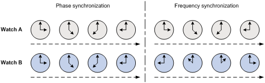
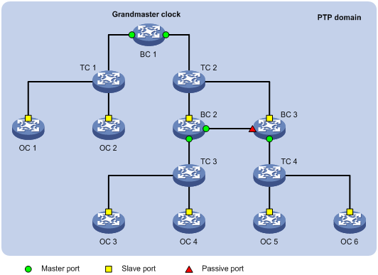
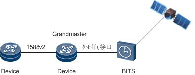
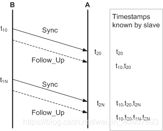
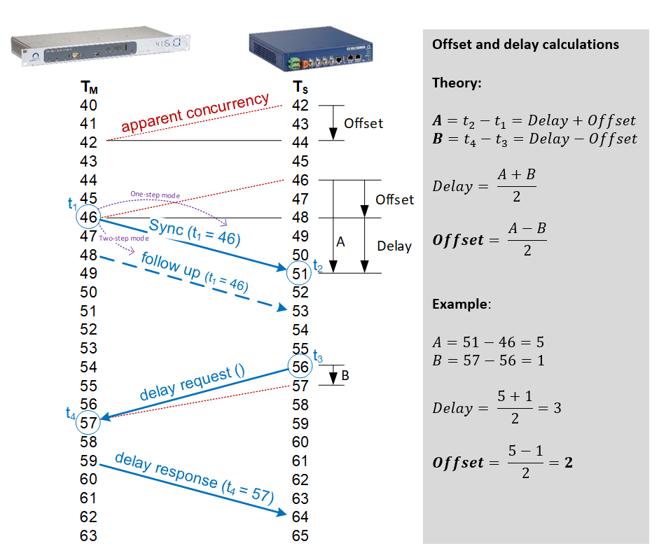
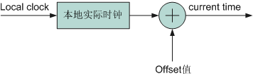
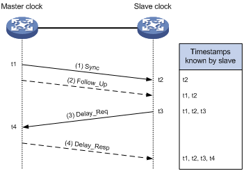
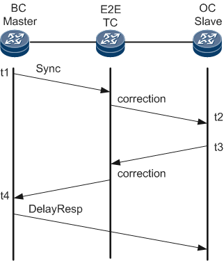
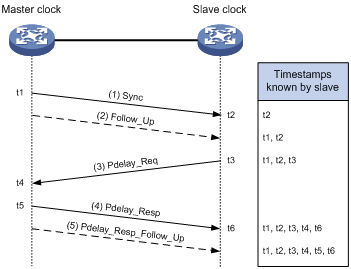
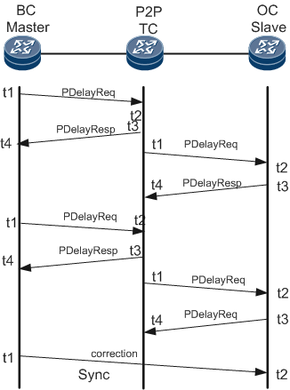

## PTP 简介

精确时间协议 PTP (precision time protocol) 是一种对标准以太网设备进行时间和频率同步的协议，由于定义在 IEEE 1588 标准中，所以也称之为 IEEE 1588，简称 1588。它是一种通过分组网络分配时间的协议，主时钟发送报文到从时钟，告诉从时钟主时钟所处的时间在这个过程中，报文延迟是个棘手的问题，而精确时间协议（PTP）大部分都致力于解决这个问题。

在通信网络中，许多业务的正常运行都要求网络时钟同步，即整个网络中各设备之间的时间或频率差保持在一个合理的误差水平内。网络时钟同步包括以下两个概念：

- 时间同步：也叫相位同步（Phase synchronization），是指信号之间的频率和相位都保持一致，即信号之间的相位差恒为零。
-  频率同步（Frequency synchronization）：也叫时钟同步，是指信号之间在频率或相位上保持某种严格的特定关系，信号在其对应的有效瞬间以同一平均速率出现，以保证通信网络中的所有设备都以相同的速率运行，即信号之间保持恒定的相位差。

如图所示，有两个表 Watch A 与 Watch B，如果这两个表的时间每时每刻都保持一致，这个状态就是时间同步；如果这两个表的时间不一致，但保持一个恒定的差值（如图中的 Watch B 总比 Watch A 晚 6 个小时），这个状态就是频率同步。

PTP（Precision Time Protocol，精确时间协议）是一种时间同步的协议，其本身只是用于设备之间的高精度时间同步，但也可被借用于设备之间的频率同步。相比现有的各种时间同步机制，PTP 具备以下优势：

1.  相比 NTP（Network Time Protocol，网络时间协议），PTP 能够满足更高精度的时间同步要求：NTP 一般只能达到毫秒级的时间同步精度，而 PTP 则可达到纳秒级。
2.  相比 GPS（Global Positioning System，全球定位系统），PTP 具备更低的建设和维护成本，不需要架设天线，无场地环境要求。

## PTP 减少误差的手段

协议使用三种关键技术来减少延迟估计中的误差：

1. 硬件时间戳 —— 精确记录事件报文通过物理接口的时间。这消除了识别和处理报文所涉及的软件延迟。
2. 边界时钟 —— 这类时钟恢复网络中间点的时间，并将时间转发到新的一组报文中。这些时钟通常可在网络中的交换机和路由器中找到，它们有助于减小网络延迟变化所带来的影响，列队延迟等因素都有可能导致这类影响。
3. 透明时钟 —— 这类时钟也可在网络中的交换机和路由器中找到。不同的是，它并不恢复并转发时间，而是记录报文通过交换机或路由器的时间。当报文最终到达从时钟时，透明时钟包含报文通过网络所累积的延迟信息，使得从时钟更准确地将其本地时间与主时钟对齐。

精确时间协议 (PTP) 支持亚微秒级准确性，较 NTP 更优。

PTP 支持分为内核和用户空间。

## PTP 基本概念

### PTP 域

应用了 PTP 协议的网络称为 PTP 域。PTP 域内有且只有一个 grandmaster 同步时钟，域内的所有设备都与该时钟保持同步。

### PTP 端口

设备上运行了 PTP 协议的端口称为 PTP 端口。PTP 端口的角色可分为以下三种：

1.  主端口（Master Port）：发布同步时间的端口，可存在于 BC 或 OC 上。
2.  从端口（Slave Port）：接收同步时间的端口，可存在于 BC 或 OC 上。
3.  被动端口（Passive Port）：既不接收同步时间、也不对外发布同步时间的端口，只存在于 BC 上。

### 时钟节点

PTP 域中的节点称为时钟节点，PTP 协议定义了以下三种类型的基本时钟节点：

（1）OC（Ordinary Clock，普通时钟）：该节点在同一个 PTP 域内只有一个 PTP 端口，只工作在 master 或 slave 状态，该端口可以作为 slave 接收上游时钟同步，也可以作为 slave 给下游设备发布时间。

（2）BC（Boundary Clock，边界时钟）：该节点在同一个 PTP 域内拥有多个 PTP 端口，其中一个可作为 slave 端口从上游时钟节点同步时间，并通过其余端口向下游时钟节点发布时间。此外，当时钟节点作为时钟源时，可以通过多个 PTP 端口向下游时钟节点发布时间的，我们也称其为 BC，如图 2 中的 BC 1。

TC（Transparent clock，透明时钟）：与 BC/OC 相比，TC 则不与其它时钟节点保持时间同步。TC 有多个 PTP 端口，但它只在这些端口间转发 PTP 协议报文并对其进行转发延时校正，而不会通过任何一个端口同步时间。TC 包括以下两种类型：

-  E2ETC（End-to-End Transparent Clock，端到端透明时钟）：直接转发网络中非 P2P（Peer-to-Peer，点到点）类型的协议报文，并参与计算整条链路的延时。
-  P2PTC（Peer-to-Peer Transparent Clock，点到点透明时钟）：只直接转发 Sync 报文、Follow_Up 报文和 Announce 报文，而终结其它 PTP 协议报文，并参与计算整条链路上每一段链路的延时。

一般 GrandMaster 的时钟来自于精确的时钟模块，时钟模块的时钟是采用的 GPS 授时校准。

除了上述三种基本时钟节点以外，还有一些混合时钟节点，譬如融合了 TC 和 OC 各自特点的 TC+OC：它在同一个 PTP 域内拥有多个 PTP 端口，其中一个端口为 OC 类型，其它端口则为 TC 类型。一方面，它通过 TC 类型的端口转发 PTP 协议报文并对其进行转发延时校正；另一方面，它通过 OC 类型的端口进行时间的同步。与 TC 的分类类似，TC+OC 也包括两种类型：E2ETC+OC 和 P2PTC+OC。

### 主从关系

主从关系（Master-Slave）是相对而言的，对于相互同步的一对时钟节点来说，存在如下主从关系：

1.  发布同步时间的节点称为主节点，而接收同步时间的节点则称为从节点。
2.  主节点上的时钟称为主时钟，而从节点上的时钟则称为从时钟。
3.  发布同步时间的端口称为主端口，而接收同步时间的端口则称为从端口。

### 最优时钟 GM

PTP 域中所有的时钟节点都按一定层次组织在一起，整个域的参考时间就是最优时钟（Grandmaster Clock，GM），即最高层次的时钟。通过各时钟节点间 PTP 协议报文的交互，最优时钟的时间最终将被同步到整个 PTP 域中，因此也称其为时钟源。

最优时钟可以通过手工配置静态指定，也可以通过 BMC（Best Master Clock，最佳主时钟）协议动态选举，动态选举的过程如下：

（1）各时钟节点之间通过交互的 Announce 报文中所携带的最优时钟优先级、时间等级、时间精度等信息，最终选出一个节点作为 PTP 域的最优时钟，与此同时，各节点之间的主从关系以及各节点上的主从端口也确定了下来。通过这个过程，整个 PTP 域中建立起了一棵无环路、全连通，并以最优时钟为根的生成树。

（2）此后，主节点会定期发送 Announce 报文给从节点，如果在一段时间内，从节点没有收到主节点发来的 Announce 报文，便认为该主节点失效，于是重新进行最优时钟的选择。

### PTP 报文

PTP 通过主从节点间交互报文，实现主从关系的建立、时间和频率同步。根据报文是否携带时间戳，可以将 PTP 报文分为两类，事件报文和通用报文。

事件报文：时间概念报文，进出设备端口时打上精确的时间戳，PTP 根据事件报文携带的时间戳，计算链路延迟。事件报文包含以下 4 种：

- Sync 由 GM 发出，用于 PTP 域内做时间同步；
- Delay_Req 由 Slave 发出，用于请求 GM 通过 E2E 测量机制建立同步；
- Pdelay_Req 由 PTP 域中 link partner A 发出通过 P2P 测量机制建立同步；
- Pdelay_Resp 由 PTP 域中 link partner B 发出的回应通过 P2P 测量机制建立同步；

通用报文：非时间概念报文，进出设备不会产生时间戳，用于主从关系的建立、时间信息的请求和通告。通用报文包含以下 4 种：

- Announce 主要用于动态选举最优时钟；
- Follow_Up 主要用于 two-step 模式下，跟随 sync 报文后发送 t1 时间；
- Delay_Resp 由 GM 发出，用于回应 slave 的 Delay_Req；
- Pdelay_Resp_Follow_Up 由 PTP 域中 link partner B 发出，跟随 Pdelay_Resp 消息；

### 消息间隔

PTP 定义了三种不同的时间间隔，应用于三种不同类型的报文：

- Announce Interval

Announce 报文的间隔的可配区间是：2^-7^ 到 2^7^

从区间上看， announce 报文的发送频率可以从每秒 128 个到每 128 秒一个。

默认是设置成 2^1^, 就是每两秒发送一个 announce 报文。

- Sync interval

Sync 报文的配置间隔和 announce 报文一样。

默认是配置成 20, 即一秒发送一次 sync 报文。

- Delay Request interval

Delay Request 报文的间隔和 announce 报文一样。

默认是配置成 20, 即每秒发送一次 Delay Request 报文。

## PTP 同步原理

主、从时钟之间交互同步报文并记录报文的收发时间，通过计算报文往返的时间差来计算主、从时钟之间的往返总延时，如果网络是对称的（即两个方向的传输延时相同），则往返总延时的一半就是单向延时，这个单向延时便是主、从时钟之间的时钟偏差，从时钟按照该偏差来调整本地时间，就可以实现其与主时钟的同步。

### 频率同步

频率同步可以只通过 Sync 和 follow up 报文来实现，通过计算对方收到报文和发送报文的时间差是否固定来判定频率是否同步，如不同步，两次报文之间的偏差就是频率的偏差，通过调整本地频率，就可以实现频率同步。

### PTP 时间同步

可以通过报文的交互，计算出 master 和 slave 之间的传输 delay 和时钟误差 offset，slave 设备通过调整本地时钟，完成和 GM 设备的时钟同步。

时间校准的过程如下图所示，slave 设备通过加入计算出的时钟误差 offset，达到和 GM 设备的时钟同步。

PTP 协议定义了两种传播延时测量机制：请求应答（Requset_Response）机制和端延时（Peer Delay）机制，且这两种机制都以网络对称为前提。

#### E2E 延时测量机制

请求应答方式用于端到端的延时测量。其实现过程如下：

(1) 主时钟向从时钟发送 Sync 报文，并记录发送时间 t1；从时钟收到该报文后，记录接收时间 t2。

(2) 主时钟发送 Sync 报文之后，紧接着发送一个携带有 t1 的 Follow_Up 报文。

(3) 从时钟向主时钟发送 Delay_Req 报文，用于发起反向传输延时的计算，并记录发送时间 t3；主时钟收到该报文后，记录接收时间 t4。

(4) 主时钟收到 Delay_Req 报文之后，回复一个携带有 t4 的 Delay_Resp 报文。

此时，从时钟便拥有了 t1～t4 这四个时间戳，由此可计算出主、从时钟间的往返总延时为 `[(t2 – t1) + (t4 – t3)]`，由于网络是对称的，所以主、从时钟间的单向延时为 `[(t2 – t1) + (t4 – t3)] / 2`。因此，从时钟相对于主时钟的时钟偏差为：`Offset = (t2 – t1) - [(t2 – t1) + (t4 – t3)] / 2 = [(t2 – t1) - (t4 – t3) ] / 2`。

此外，根据是否需要发送 Follow_Up 报文，请求应答机制又分为单步模式和双步模式两种：

- 在单步模式下，Sync 报文的发送时间戳 t1 由 Sync 报文自己携带，不发送 Follow_Up 报文。

- 在双步模式下，Sync 报文的发送时间戳 t1 由 Follow_Up 报文携带。

BC/OC 与 E2E-TC 的组网以及报文交互过程:

#### P2P 延时测量机制

与请求应答机制相比，端延时机制不仅对转发延时进行扣除，还对上游链路的延时进行扣除。其实现过程如下：

(1) 主时钟向从时钟发送 Sync 报文，并记录发送时间 t1；从时钟收到该报文后，记录接收时间 t2。

(2) 主时钟发送 Sync 报文之后，紧接着发送一个携带有 t1 的 Follow_Up 报文。

(3) 从时钟向主时钟发送 Pdelay_Req 报文，用于发起反向传输延时的计算，并记录发送时间 t3；主时钟收到该报文后，记录接收时间 t4。

(4) 主时钟收到 Pdelay_Req 报文之后，回复一个携带有 t4 的 Pdelay_Resp 报文，并记录发送时间 t5；从时钟收到该报文后，记录接收时间 t6。

(5) 主时钟回复 Pdelay_Resp 报文之后，紧接着发送一个携带有 t5 的 Pdelay_Resp_Follow_Up 报文。

此时，从时钟便拥有了 t1～t6 这六个时间戳，由此可计算出主、从时钟间的往返总延时为 `[(t4 – t3) + (t6 – t5)]`，由于网络是对称的，所以主、从时钟间的单向延时为 `[(t4 – t3) + (t6 – t5)] / 2`。因此，从时钟相对于主时钟的时钟偏差为：`Offset = (t2 – t1) - [(t4 – t3) + (t6 – t5)] / 2`。

此外，根据是否需要发送 Follow_Up 报文，端延时机制也分为单步模式和双步模式两种：

- 在单步模式下，Sync 报文的发送时间戳 t1 由 Sync 报文自己携带，不发送 Follow_Up 报文；而 t5 和 t4 的差值由 Pdelay_Resp 报文携带，不发送 Pdelay_Resp_Follow_Up 报文。

- 在双步模式下，Sync 报文的发送时间戳 t1 由 Follow_Up 报文携带，而 t4 和 t5 则分别由 Pdelay_Resp 报文和 Pdelay_Resp_Follow_Up 报文携带。

BC/OC 与 P2P-TC 的组网以及报文交互过程:

