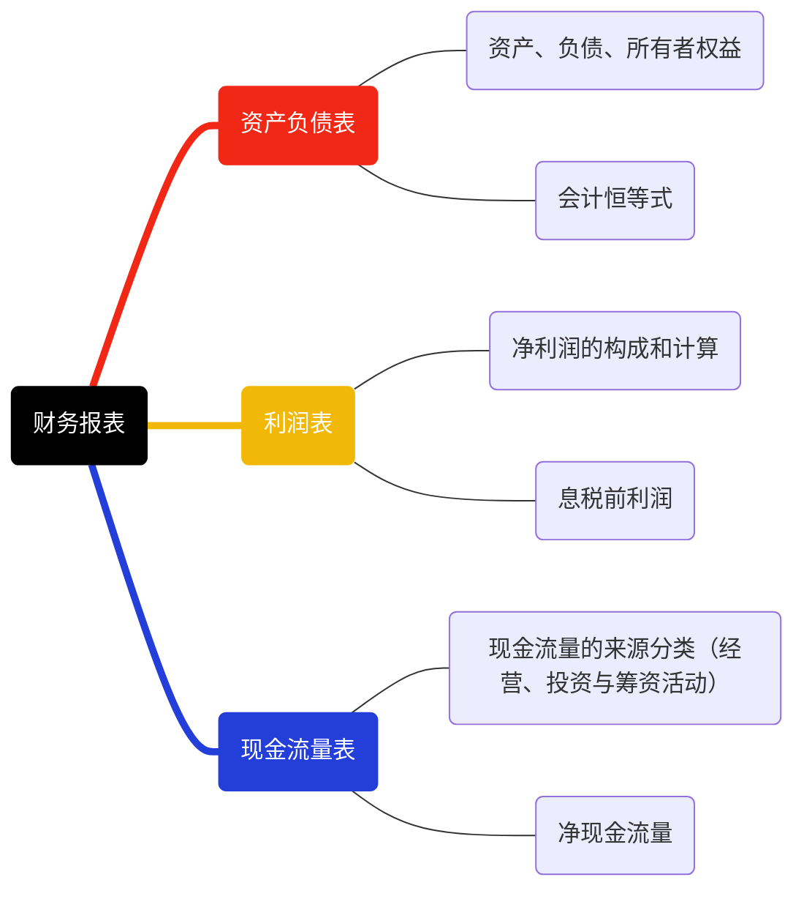

```mermaid
%% graph 定义流程图，方向从左到右
graph LR

%% 把每个节点定义成变量
root(财务报表)
root1(资产负债表)
root2(利润表)
root3(现金流量表)
root11(资产、负债、所有者权益)
root12(会计恒等式)
root21(净利润的构成和计算)
root22(息税前利润)
root31(现金流量的来源分类（经营、投资与筹资活动）)
root32(净现金流量)

%% 定义变量后再开始连接节点
root --- root1
root --- root2
root --- root3
root1 --- root11
root1 --- root12
root2 --- root21
root2 --- root22
root3 --- root31
root3 --- root32

%% 绘制节点的样式，fill 背景色，stroke 边框，color 字体颜色
style root fill:black,stroke:black,stroke-width:1px,color:white
style root1 fill:#f22816,stroke:#f22816,stroke-width:1px,color:white
style root2 fill:#f2b807,stroke:#f2b807,stroke-width:1px,color:white
style root3 fill:#233ed9,stroke:#233ed9,stroke-width:1px,color:white

%% 绘制线条的样式
linkStyle 0 stroke:#f22816,stroke-width:5px;
linkStyle 1 stroke:#f2b807,stroke-width:5px;
linkStyle 2 stroke:#233ed9,stroke-width:5px;
```