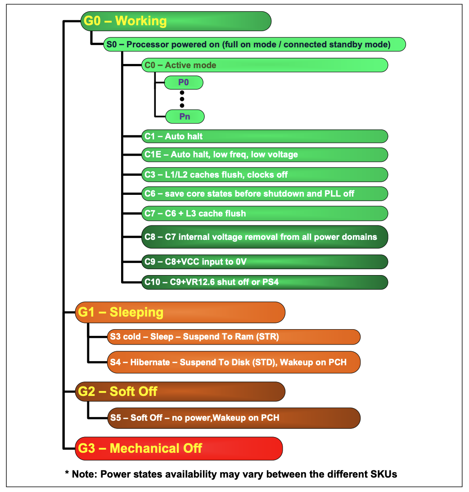
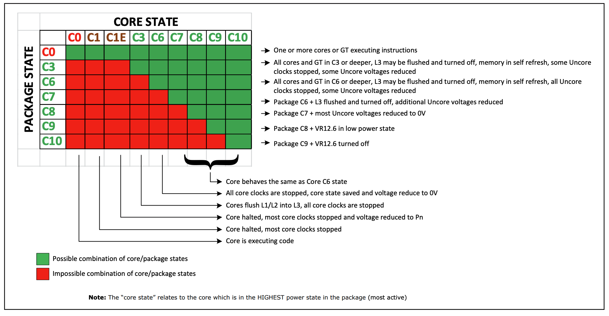
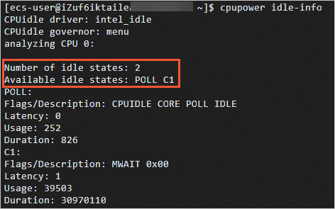
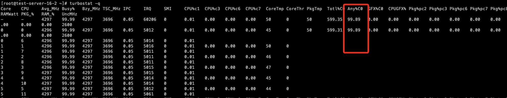

## C-states

为了在 CPU 空闲时节约能源，可以命令 CPU 进入低功耗模式。C-state 用于控制 CPU 在不活动时可以进入的休眠级别，它从 C0 开始编号（CPU 处于正常工作状态），一直到 C6（最深的休眠级别，此时 CPU 进入低功耗状态）。

当 CPU 进入较深的 C-state 时，其唤醒时延也会变大，在一些实时性要求较高的负载场景，会对性能产生影响。每次应用程序尝试在一个 CPU 来执行某些任务时，相应的 CPU 必须从其 “更深的睡眠状态” 返回到 “运行状态”，这需要更多时间来唤醒计算机。 CPU 并再次 100％启动并运行。这个过程还必须在原子环境中完成，以便在启动 CP U 核心时没有任何人尝试使用 cpu 核心。

C 状态是空闲的节能状态，而 P 状态是执行节能状态。在 P 状态期间，处理器仍在执行指令，而在 C 状态（C0 除外）期间，处理器处于空闲状态，这意味着没有任何东西正在执行。

C 状态：

- C0 是运行状态，表示 CPU 正在执行有用的工作。C0 比较特殊，它是正常的 CPU 工作模式，即 CPU 已 100％的开启。
- C1 是第一个空闲状态
- C2 是第二种空闲状态：外部 I/O 控制器集线器阻止对处理器的中断。
- ...

| mode   | Name                  | What id does                                                 | CPUs                                                         |
| ------ | --------------------- | ------------------------------------------------------------ | ------------------------------------------------------------ |
| C0     | Operating State       | CPU fully turned on, currently executing instructions.       | All CPUs                                                     |
| C1     | Operating State       | CPU fully turned on, awaiting instructions                   | All CPUs                                                     |
| C1E    | Halt                  | Stops CPU main internal clocks via software; bus interface unit and APIC are kept running at full speed | 486DX4 and above                                             |
| C1E    | Enhanced Halt         | Stops CPU main internal clocks via software and reduces CPU voltage; bus interface unit and APIC are kept running at full speed | All socket 775 CPUs                                          |
| C1E    | --                    | Stops all CPU internal clocks                                | Turion 64, 65-nm Athlon X2 and Phenom CPUs                   |
| C2     | Stop Grant            | Stops CPU main internal clocks via hardware; bus interface unit and APIC are kept running at full speed | 486DX4 and above                                             |
| C2     | Stop Clock            | Stops CPU internal and external clocks via hardware          | Only 486DX4, Pentium, Pentium MMX, K5, K6, K6-2, K6-III      |
| C2E    | Extended Stop Grant   | Stops CPU main internal clocks via hardware and reduces CPU voltage; bus interface unit and APIC are kept running at full speed | Core 2 Duo and above (Intel only)                            |
| C3     | Sleep                 | Stops all CPU internal clocks                                | Pentium II, Athlon and above, but not on Core 2 Duo E4000 and E6000 |
| C3     | Deep Sleep            | Stops all CPU internal and external clocks                   | Pentium II and above, but not on Core 2 Duo E4000 and E6000; Turion 64 |
| C3     | AltVID                | Stops all CPU internal clocks and reduces CPU voltage        | AMD Turion 64                                                |
| C4     | Deeper Sleep          | Reduces CPU voltage                                          | Pentium M and above, but not on Core 2 Duo E4000 and E6000 series; AMD Turion 64 |
| C4E/C5 | Enhanced Deeper Sleep | Reduces CPU voltage even more and turns off the memory cache | Core Solo, Core Duo and 45-nm mobile Core 2 Duo only         |
| C6     | Deep Power Down       | Reduces the CPU internal voltage to any value, including 0 V | 45-nm mobile Core 2 Duo only                                 |

Processor Power States



Processor Package and Core C-States



## 禁用处理器睡眠状态

### 调整内核命令行参数

当 CPU 没有负载时，让 CPU 处于较低的 C-state 状态可以减少指令的开销，同时也能降低 CPU 的唤醒时延。但是当操作系统让 CPU 进入更深的 C-state 时，将 CPU 重新唤醒（比如网卡上有新的中断）并执行指令需要一定的时间，这个唤醒时间开销由 CPU 芯片架构决定。可以配置操作系统禁用更深的 C-state 状态，以降低 CPU 的响应延迟。

```bash
# 查看状态
# 执行以下命令显示相应的 CPUidle driver
cpupower idle-info

# 设置
cpupower idle-set -D 0
```

Grub 参数，`intel_idle.max_cstate=0` 和 `processor.max_cstate=0` 选项，将空闲 CPU 的最大 C-state 限制为 C1。

```bash
# intel
grubby --update-kernel=ALL --args=intel_idle.max_cstate=0
grubby --update-kernel=ALL --args=processor.max_cstate=0
```

- `intel_idle.max_cstate=0`

 在 intel 平台上，模式会使用 intel cpuidle drviver，`intel_idle.max_cstate=0` 意味着禁用 intel cpuidle driver，让其使用 acpi driver。

<https://github.com/torvalds/linux/blob/v5.14/drivers/idle/intel_idle.c#L1690-L1703>

```c
static int __init intel_idle_init(void)
{
	const struct x86_cpu_id *id;
	unsigned int eax, ebx, ecx;
	int retval;

	/* Do not load intel_idle at all for now if idle= is passed */
	if (boot_option_idle_override != IDLE_NO_OVERRIDE)
		return -ENODEV;

	if (max_cstate == 0) {
		pr_debug("disabled\n");
		return -EPERM;
	}
```

- `processor.max_cstate=0`

`processor.max_cstate=0` 用描述 acpi driver 中 cpu cstate 的最大级别，但是实际 max_cstate=0 并不能真的让 CPU 保持在 C0 态，只能让 CPU 保持在 C1 状态

<https://github.com/torvalds/linux/blob/v5.14/drivers/acpi/processor_idle.c#L722-L730>

```c
static int acpi_processor_setup_cpuidle_cx(struct acpi_processor *pr,
					   struct cpuidle_device *dev)
{
	int i, count = ACPI_IDLE_STATE_START;
	struct acpi_processor_cx *cx;
	struct cpuidle_state *state;

	if (max_cstate == 0)
		max_cstate = 1;
```

因此以下是等效的

```bash
processor.max_cstate=0 intel_idle.max_cstate=0

processor.max_cstate=1 intel_idle.max_cstate=0
```

重启，查看当前系统使用的 CPUidle driver 以及支持的 C-states

返回信息如下所示，说明系统仅支持 2 种 C-states 状态（POLL、C1）。



### 使用电源管理服务质量接口（PM QOS）

文件 `/dev/cpu_dma_latency` 是一个字符设备，当打开该接口时，它会注册一个服务质量请求以请求操作系统的延迟。程序应打开 `/dev/cpu_dma_latency`，向其写入一个 32 位数字，该数字表示最大响应时间（以微秒为单位），写入零表示想要最快的响应时间。

通常 cpu_dma_latency 被系统 tuned 服务使用，通过配置文件来修改 cpu _dma_latency 的值，下面是是 tuned 配置文件中的一部分：

```bash
[cpu]  
force_latency = 1
```

以使用 hexdump 工具来读此文件

```bash
[root@test-server ~]# hexdump /dev/cpu_dma_latency
0000000 9400 7735
0000004
[root@test-server ~]# echo $((0x77359400))
2000000000
```

cpu_dma_latency 反馈的数值，表示当前等待时间值为 2000 秒，这是 CPU 从较深的 C 状态变为 C0 所需或需要的时间。

在 RHEL 上，默认设置为 2000 秒。使用 `force_latency = 1` 设置调整 cpu_dma_latency 时，可以用 tuned-adm 命令来调整。

```bash
[root@test-server ~]# head /lib/tuned/latency-performance/tuned.conf | grep latency -a1
[cpu]
force_latency=cstate.id_no_zero:1|3
governor=performance

[root@test-server ~]# tuned-adm profile latency-performance
[root@test-server ~]# hexdump /dev/cpu_dma_latency
0000000 0003 0000
0000004
[root@test-server ~]# echo $((0x00000003))
3
```

可以看到，等待时间值已更改为 3 微秒。

tuned 的配置文件将 force_latency 写为较低值，作用：以确保 CPU C-state 不会进入除 C1 之外的更深的 C 状态。

通常只要调整 latency 后，cpu_dma_latency 文件处于激活状态，该文件描述符将始终处于打开状态。

```bash
[root@test-server ~]# lsof | grep cpu_dma
tuned     14507                    root    7w      CHR             10,124      0t0        157 /dev/cpu_dma_latency
tuned     14507 14730 tuned        root    7w      CHR             10,124      0t0        157 /dev/cpu_dma_latency
tuned     14507 14737 tuned        root    7w      CHR             10,124      0t0        157 /dev/cpu_dma_latency
tuned     14507 14738 tuned        root    7w      CHR             10,124      0t0        157 /dev/cpu_dma_latency
```

由于 cpu_dma_latency（PM qos）会影响到 cpuidle driver 的 governor 的处理逻辑，所以会影响不同 C-state 的进入。

cpuidle 有 2 种 governor：ladder 和 menu，分别代表按顺序计入 C-state，和选择进入。

cpu 在进入 idle 时，会通过 cpuidle governor 的策略选择合适的 C-state 进入。

<https://github.com/torvalds/linux/blob/v5.14/drivers/cpuidle/governors/menu.c#L259-L426>

<https://github.com/torvalds/linux/blob/v5.14/drivers/cpuidle/governor.c#L105-L120>

```c
/**
 * cpuidle_governor_latency_req - Compute a latency constraint for CPU
 * @cpu: Target CPU
 */
s64 cpuidle_governor_latency_req(unsigned int cpu)
{
	struct device *device = get_cpu_device(cpu);
	int device_req = dev_pm_qos_raw_resume_latency(device);
	int global_req = cpu_latency_qos_limit();

	if (device_req > global_req)
		device_req = global_req;

	return (s64)device_req * NSEC_PER_USEC;
}
```

## 查看 CPU C-state 信息

### CPU 允许的最大 C-state

intel CPU 一般会有多个 CPU c-state，但实际也要根据 cmdline 的中提供的 max_cstate 设定值，具体来说不同型号的处理器所允许的最大 c 状态会有所不同。

```bash
cat /sys/module/intel_idle/parameters/max_cstate
```

`cpupower idle-info` 命令列出了支持的 C 状态：

```bash
[root@test-server ~]# cpupower idle-info
CPUidle driver: intel_idle
CPUidle governor: menu
analyzing CPU 2:

Number of idle states: 9
Available idle states: POLL C1 C1E C3 C6 C7s C8 C9 C10
POLL:
Flags/Description: CPUIDLE CORE POLL IDLE
Latency: 0
Usage: 5015
Duration: 84275
C1:
Flags/Description: MWAIT 0x00
Latency: 2
Usage: 141597
Duration: 42805628
C1E:
Flags/Description: MWAIT 0x01
Latency: 10
Usage: 347461
Duration: 152959833
C3:
Flags/Description: MWAIT 0x10
Latency: 70
Usage: 38317
Duration: 6809443
...
```

### 不同 C-state 的唤醒延迟值

延迟时间值可能会根据各种 C-state 以及从更深的 C-state 到 C0 的过渡时间而变化。

sysfs 中查看 CPU 每个 C-state 的 exit_latency 延迟值: （exit_latency 由驱动指定）

```bash
cd /sys/devices/system/cpu/cpu0/cpuidle

for state in state{0..8};do echo c-$state `cat $state/name` `cat $state/latency`;done
```

示例输出

```bash
[root@test-server cpuidle]# for state in state{0..8};do echo c-$state `cat $state/name` `cat $state/latency`;done
c-state0 POLL 0
c-state1 C1 2
c-state2 C1E 10
c-state3 C3 70
c-state4 C6 85
c-state5 C7s 124
c-state6 C8 200
c-state7 C9 480
c-state8 C10 890
```

### 检查每个CPU 和核心的 C 状态使用情况

intel 平台可以使用 turbostat 工具，该工具可以查所有可用 CPU 核心的 c-state 使用量及占用百分比。

```bash
turbostat -q
```



`cpupower monitor` C 状态的统计信息：

````bash
[root@test-server ~]# cpupower monitor -m Idle_Stats
intel-rapl/intel-rapl:0
0
intel-rapl/intel-rapl:0/intel-rapl:0:0
0
intel-rapl/intel-rapl:0/intel-rapl:0:1
0
    | Idle_Stats
 CPU| POLL | C1   | C1E  | C3   | C6   | C7s  | C8   | C9   | C10
   0|  0.00|  0.00|  0.04|  0.00|  0.00|  0.00|  0.00|  0.00| 95.61
   8|  0.00|  0.00|  0.00|  0.00|  0.00|  0.00|  0.00|  0.00| 399.7
   1|  0.00|  0.00|  0.04|  0.00|  0.29|  0.00|  1.51|  0.00| 94.16
   9|  0.00|  0.00|  0.00|  0.00|  0.00|  0.00|  0.00|  0.00| 399.7
   2|  0.00|  0.00|  0.00|  0.00|  0.00|  0.00|  0.00|  0.00| 399.7
  10|  0.00|  0.00|  1.00|  0.00|  0.51|  0.00|  0.30|  0.00| 98.10
   3|  0.00|  0.00|  0.00|  0.00|  0.00|  0.00|  0.00|  0.00| 399.7
  11|  0.00|  0.00|  0.00|  0.00|  0.00|  0.00|  0.00|  0.00| 96.32
   4|  0.00|  0.00|  0.00|  0.00|  0.00|  0.00|  0.00|  0.00| 140.1
  12|  0.00|  0.00|  0.03|  0.00|  0.76|  0.00|  0.00|  0.00| 105.6
   5|  0.00|  0.00|  0.38|  0.00|  0.00|  0.00|  0.00|  0.00| 95.55
  13|  0.00|  0.00|  0.00|  0.00|  0.00|  0.00|  0.00|  0.00| 101.9
   6|  0.00|  0.00|  0.00|  0.00|  0.15|  0.00|  1.19|  0.00| 398.3
  14|  0.00|  0.00|  0.00|  0.00|  0.00|  0.00|  0.00|  0.00| 399.7
   7|  0.00|  0.00|  0.00|  0.00|  0.00|  0.00|  0.00|  0.00| 399.7
  15|  0.00|  0.00|  0.00|  0.00|  0.00|  0.00|  0.00|  0.00| 108.8
````

## POLL idle 状态

`idle=poll/halt/momwait`

- poll：禁止 CPU 进入休眠状态
- halt：使用 HALT 指令让 CPU 最多进入到 C1 休眠状态。
- nomwait：进入休眠状态时，禁止使用 MWAIT 指令。

添加 `idle=poll` 参数可以让 CPU 完全处于 C0 状态，当 CPU 空闲时其实是执行 busy-loop

```bash
grubby --update-kernel=ALL --args=idle=poll
```

POLL idle 状态不是真正的空闲状态，它不节省任何功率。取而代之的是，执行 busy-waiting。如果足够了解自己的应用程序，对延迟很敏感，让内核知道必须尽快处理工作，因为进入任何实际的硬件空闲状态可能会导致轻微的性能损失，则可以使用此状态。

## CPU idel 驱动

X86 体系结构平台上存在两种不同的 cpuidle 驱动程序：

- acpi_idle cpuidle 驱动程序从 ACPI BIOS 表（从最新平台上的_CST ACPI 函数或从较旧平台上的 FADT BIOS 表）检索可用的睡眠状态（C 状态）。不会从 ACPI 表中检索 C1 状态。如果进入 C1 状态，内核将调用 hlt 指令（或 Intel 上的 mwait）。

- intel_idle cpuidle 驱动程序在内核 2.6.36 中引入。它仅服务于最近的 Intel CPU（Nehalem，Westmere，Sandybridge，Atoms 或更高版本）。在较旧的 Intel CPU 上，仍使用 acpi_idle 驱动程序（如果 BIOS 提供 C 状态 ACPI 表）。intel_idle 驱动程序知道处理器的睡眠状态功能，并忽略 ACPI BIOS 导出的处理器睡眠状态表。

操作系统可能会基于正在使用的 cpuidle 驱动程序忽略 BIOS 设置。针对不同的硬件厂商，BIOS 中的实现也不一样，有些服务器 BIOS 中没有关闭 C-state 选项。如果使用 intel_idle（intel 计算机上的默认设置），则 OS 可以忽略 ACPI 和 BIOS 设置，即驱动程序可以重新启用 C 状态。

如果禁用 intel_idle 并使用较旧的 acpi_idle 驱动程序，则操作系统应遵循 BIOS 设置。可以通过以下方式禁用 intel_idle 驱动程序：将 `intel_idle.max_cstate = 0` 传递到内核命令行或传递 `idle = xxx` （可以是 poll，即 idle = poll）

查看当前加载的驱动程序

```bash
[root@test-server ~]# cat /sys/devices/system/cpu/cpuidle/current_driver
intel_idle
# 禁用后变为 none

[root@test-server ~]# cat /sys/devices/system/cpu/cpuidle/current_governor_ro
menu
```

## 总结

目前来看，关于 C-state，使用 OS 来控制 C-state 的进出是最稳妥的做法。

比如：添加 `idle=poll` 内核参数，可以让 CPU 完全不进入 C-state。

```bash
grubby --update-kernel=ALL --args=intel_idle.max_cstate=0
grubby --update-kernel=ALL --args=processor.max_cstate=0

grubby --update-kernel=ALL --args=idle=poll
```

## 参考资料

- <https://access.redhat.com/solutions/202743>

- <https://vstinner.github.io/intel-cpus.html>
- <https://blog.csdn.net/weixin_45959095/article/details/120311110>
