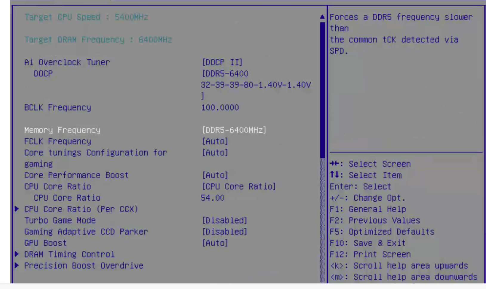
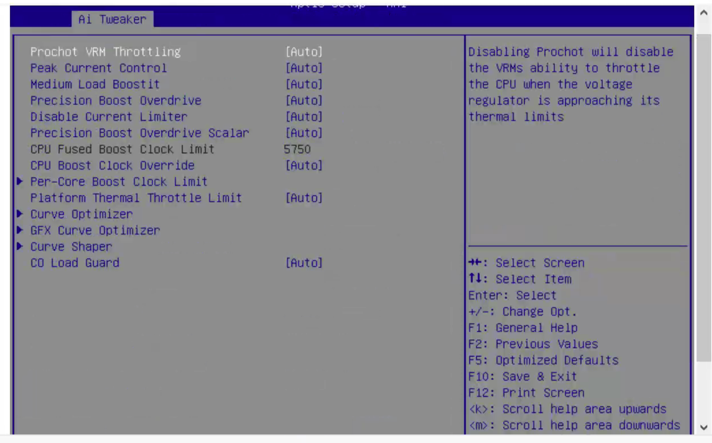
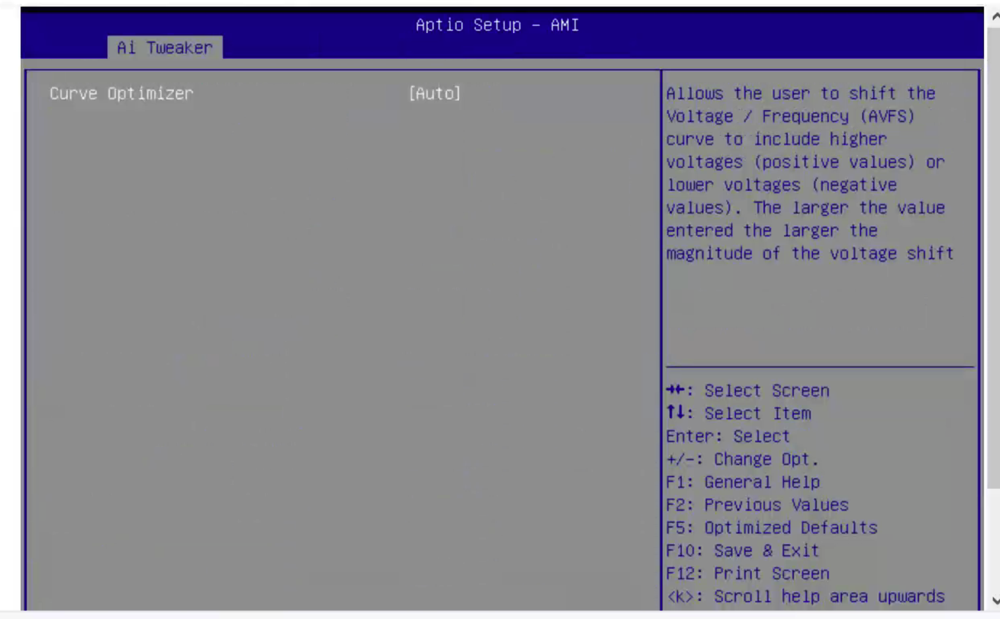
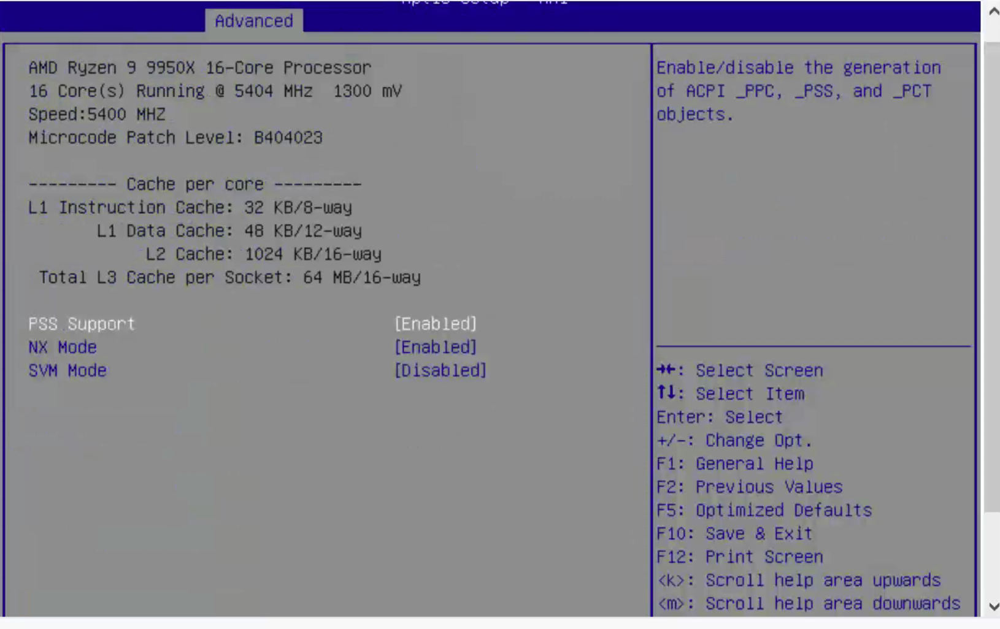
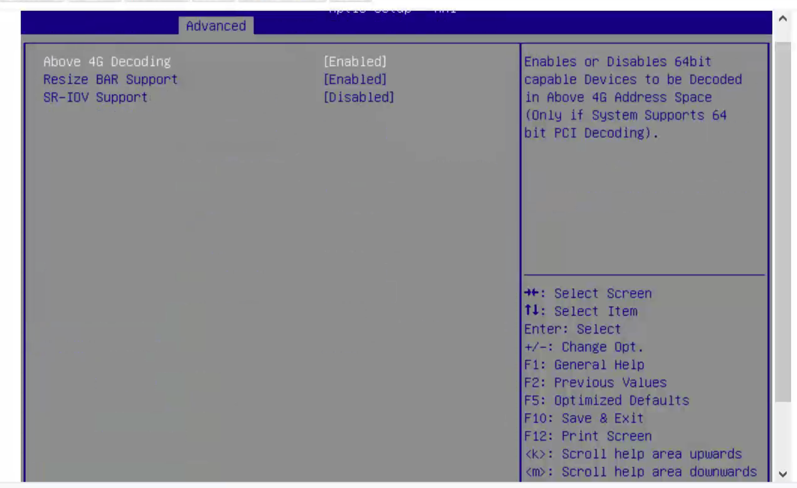
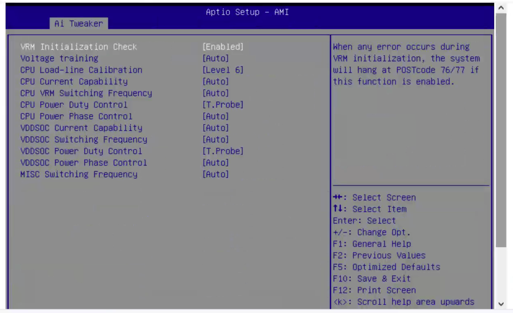

## 当前环境

ASUS ProArt X870E-CREATOR WIFI、AMD Ryzen 9 9950X 16-Core Processor、48 GB 内存 * 2（双通道）、RockyLinux 8.7（由于当前思科驱动的限制）

## BIOS 调优

关闭超线程

关闭 cstate？



Precision Boost Override














## 内核参数调整

```bash
ipv6.disable=1 ipv6.autoconf=0 idle=poll amd_idle.max_cstate=0 mce=ignore_ce consoleblank=0 iommu=off amd_iommu=off skew_tick=1 tsc=reliable nosoftlockup nmi_watchdog=0 transparent_hugepage=never audit=0 selinux=0 pcie_aspm=force pcie_aspm.policy=performance mitigations=off noibrs noibpb nopti nospectre_v2 nospectre_v1 l1tf=off nospec_strore_bypass_disable no_stf_barrier mds=off tsx=on tsx_async_abort=off nohz=on isolcpus=1-15 nohz_full=1-15 rcu_nocb_poll rcu_nocbs=1-15 irqaffinity=0
```

### 网络相关

- `ipv6.disable=1`：禁用 IPv6 协议栈。
- `ipv6.autoconf=0`：禁用 IPv6 的自动配置（如 SLAAC）。

用途：避免 IPv6 带来的不必要网络栈复杂性或安全隐患。

### CPU 节能与性能模式相关

- `idle=poll`：CPU 空闲时不断轮询，而不是进入休眠状态，提升响应速度但增加功耗。

- `amd_idle.max_cstate=0`：AMD CPU 的 C-State 限制为 0，禁止进入低功耗状态。

- `iommu=off` / `amd_iommu=off`：禁用 IOMMU（内存映射单元），提升设备直通性能，但损失安全性。

- `skew_tick=1`：启用 tick 偏移，减少系统中断集中度，提升实时性。

- `tsc=reliable`：告诉系统 TSC（时间戳计数器）是可靠的，可以用于时间基准。 

用途：都属于为最大化 CPU 响应时间、降低延迟而禁用省电和系统管理机制。

### CPU 安全补丁相关

- `mitigations=off`：关闭所有已知 CPU 安全漏洞的缓解措施。

- `noibrs` `noibpb` `nopti`：禁用 Intel 相关缓解（间接分支、Page Table Isolation）。

- `nospectre_v1` `nospectre_v2`：禁用 Spectre V1/V2 的补丁。

- `l1tf=off` `mds=off`：禁用 L1 Terminal Fault、Microarchitectural Data Sampling 缓解。

- `tsx=on` `tsx_async_abort=off`：启用 TSX 并关闭相关缓解措施（TAA）。

- `nospec_store_bypass_disable` `no_stf_barrier`：禁用 Store Bypass 与 STF 屏障缓解。

用途：大幅提升性能，但降低系统安全性。适用于物理隔离、可信环境。

### 调试与系统稳定性相关

- `mce=ignore_ce`：忽略可纠正的机器检查异常（Correctable Errors）。

- `consoleblank=0`：关闭控制台空白屏节能机制。

- `nosoftlockup`：关闭软锁定 watchdog，避免误报系统 hang。

- `nmi_watchdog=0`：关闭硬件 NMI 看门狗。

- `audit=0`：禁用审计系统（减少日志负担）。

- `selinux=0`：禁用 SELinux。

 用途：减少日志、减少中断、减轻内核负担，提升可预测性。

### 内存与 I/O

- `transparent_hugepage=never`：禁用透明大页，减少内存分配延迟。

- `pcie_aspm=force` `pcie_aspm.policy=performance`：强制使用 PCIe 的性能策略（非省电）。

用途：确保最大带宽、最小延迟。

### 时间与中断控制

- `nohz=on`：开启 NO_HZ 模式，减少定时器中断负担。

- `isolcpus=1-15`：隔离 CPU 核心 1 到 15，不参与调度，适合实时任务绑定。

- `nohz_full=1-15`：配合 `isolcpus`，完全禁用指定核心的周期性 tick。

- `rcu_nocb_poll`：RCU 回调采用主动轮询而不是中断。

- `rcu_nocbs=1-15`：指定 CPU 不参与 RCU 回调处理。

- `irqaffinity=0`：所有中断只绑定到 CPU 0。 

用途：典型的实时隔离设置（RT 线程在 1-15 核心上运行），提高确定性。

## Sysctl 调整内核参数

```bash
net.ipv4.tcp_timestamps=0
net.ipv4.tcp_sack=0
net.core.netdev_max_backlog=250000
net.ipv4.tcp_mem=16777216 16777216 16777216
net.ipv4.tcp_rmem=4096 87380 16777216
net.ipv4.tcp_wmem=4096 65536 16777216
net.core.rmem_default=16777216
net.core.wmem_default=16777216
net.core.optmem_max=16777216
net.core.rmem_max=16777216
net.core.wmem_max=16777216
net.ipv4.tcp_low_latency=1
kernel.sched_rt_runtime_us=-1
vm.stat_interval=1000
vm.nr_hugepages=4096
```

## tuned

```bash
# tuned-adm active
Current active profile: throughput-performance
```

## limits

```
# End of file
     *           soft    core       unlimited
     *           hard   core       unlimited
     *           soft    nproc     65536
     *           hard   nproc     65536
     *           soft    nofile      65536
     *           hard   nofile      65536
```

## 参考资料

- <https://zhuanlan.zhihu.com/p/356507791>
