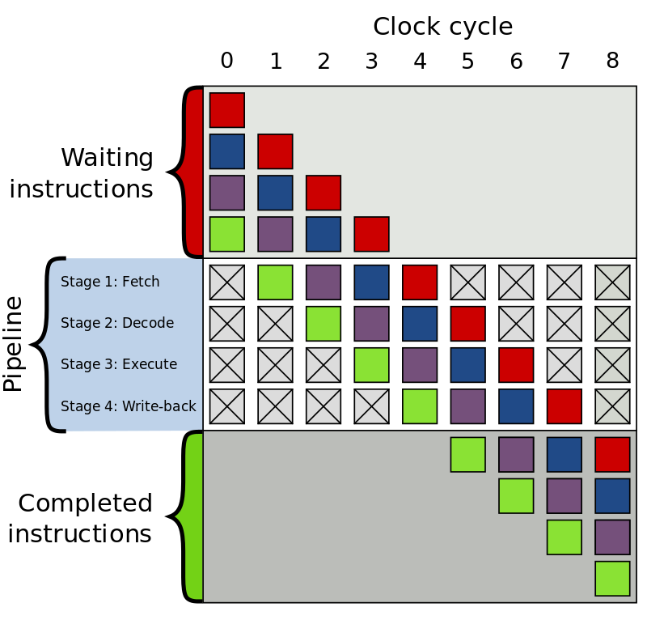

## 指令分支

在计算机程序中，分支无处不在。if-else 语句、switch 语句、循环（for、while）等等，都是分支，专业术语叫条件跳转（conditional jump）

每当程序遇到一个分支，它都需要停下来，判断条件，然后选择下一步要执行的代码。

这个“停下来，判断”的过程，看似微不足道，但在低延迟交易的世界里，却会累积成巨大的时间开销。原因在于现代 CPU 的“流水线”（Pipeline）设计。

## 参考资料

- <https://blog.csdn.net/xindoo/article/details/101762198>
- <https://djs66256.github.io/2019/01/29/2019-01-29-CPU%E5%88%86%E6%94%AF%E9%A2%84%E6%B5%8B/>